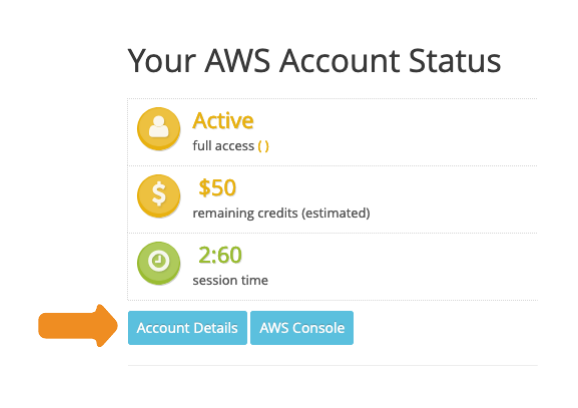
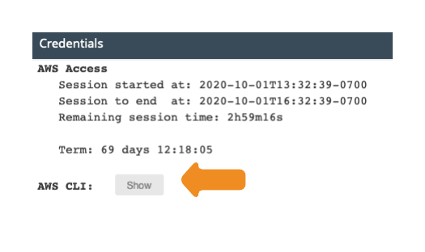
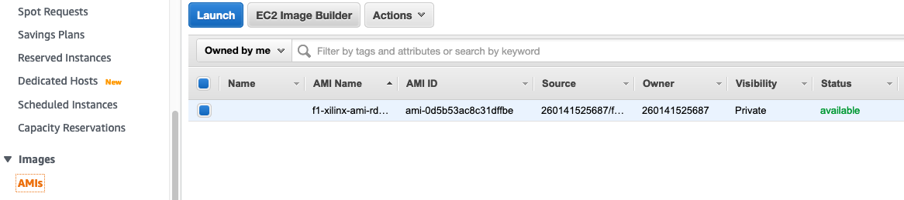

# How to Create a FPGA Developer AMI for Educators using Packer

## Prerequisites
* You will need an AWS account with IAM credentials.
* Your AWS Account must have a default VPC.
**Note:** If your account lacks a default VPC, you can specify one in the packer template. See the packer documentation [here](https://www.packer.io/docs/builders/amazon-ebs) for more information.

## Setup

####1. Clone the repository

```
$ git clone https://github.com/awslabs/aws-fpga-app-notes.git
$ cd FPGA_Developer_AMI_Build_Recipe_AL2/
```

####1. Download and install packer
  See this documentation for how to install packer:
  https://learn.hashicorp.com/tutorials/packer/getting-started-install

####2. Download Xilinx Web Installer from the Xilinx downloads website:
https://www.xilinx.com/member/forms/download/xef.html?filename=Xilinx_Unified_2020.1_0602_1208_Lin64.bin

#### 3a. Obtain your AWS credentials (AWS Console)
Follow the instructions [here](https://docs.aws.amazon.com/cli/latest/userguide/cli-configure-quickstart.html#cli-configure-quickstart-creds) to get your AWS Credentials.

#### 3b. Obtain your AWS credentials (AWS Classroom)
##### a. Log into your AWS Classrom, and select "Account Details"



##### b. Click the "Show" button next to "AWS CLI:" Copy these credentials to a safe place, you'll need them later.




## Build the Image
####4. Copy the Xilinx installer to the `./files` directory
 If you have a license file, copy that to the `./files` directory as well.

####5. Modify the variables in `ansible/xilinx_playbook.yaml`.
You must provide your xilinx.com credentials (`xilinx_username` and `xilinx_password`).

To disable rdp or dcv, set the `install_rdp` or `install_dcv` variables to `false`.

**Note:** YAML files are very particular about indentation. Be sure to keep the indentation the same when editing the playbook.

```yaml
vars:
  # Modify these variables for your environment
  xilinx_username: 'user@example.com'
  xilinx_password: 'mypassword'
  xilinx_installer: 'Xilinx_Unified_2020.1_0602_1208_Lin64.bin'
  # Set these to "false" to disable rdp or dcv
  install_rdp: true
  install_dcv: true
```
**Note:** The Xilinx installer will reject passwords that contain the '@' symbol. If your password contains an '@', please change your Xilinx.com password to something else.

####6. Update the `packer_xilinx_template.json` file.

Enter your AWS credentials from Step 2 into `aws_access_key`, `aws_secret_key`, and `aws_session_token`, replacing both sets of brackets.  

(Optional) Specify a name for the AMI in `ami_name`.

(Optional) If you'd like to build on a different instance type, you can modify `instance_type`. The default is an m5.2xlarge which should work within AWS Academy's limits.

**Note:** `instance type` refers to the instance that you will use to build the image, not the F1 instance that you will use later.
```json
"variables": {
  "aws_access_key": "{{env `AWS_ACCESS_KEY_ID`}}",
  "aws_secret_key": "{{env `AWS_SECRET_ACCESS_KEY`}}",
  "aws_session_token": "{{env `AWS_SESSION_TOKEN`}}",
  "region": "us-east-1",
  "instance-type": "m5.2xlarge",
  "ami_name": "packer-linux-aws-demo-{{timestamp}}"
},
```

####7. Run `packer build packer_xilinx_template.json`
The build will take a bit more than two hours.


####8. Log into the AWS console to see the AMI


**Note:** The ec2-user password will be set to the instance ID at launch (i.e. "i-043a81572c26828e6"). This can be changed by the user after they've launched the instance.

## Troubleshooting

### Incorrect Region
AWS Academy only uses the `us-east-1` region. If you receive a message like the following, switch region back to `us-east-1`
```
Build 'amazon-ebs' errored after 841 milliseconds 858 microseconds: error validating regions:
UnauthorizedOperation: You are not authorized to perform this operation.
	status code: 403, request id: c9d0a940-ba62-4f04-9b8f-8a67f2580b77
```

### Build completes, but times out with "AMI: Failed with ResourceNotReady" error
Due to the size of the AMI, packer can time out before AMI is fully available. This is expected and the AMI will still be built.
```
Build 'amazon-ebs' errored after 1 hour 13 minutes: Error waiting for AMI: Failed with ResourceNotReady error, which can have a variety of causes. For help troubleshooting, check our docs: https://www.packer.io/docs/builders/amazon.html#resourcenotready-error
original error: ResourceNotReady: exceeded wait attempts

==> Wait completed after 1 hour 13 minutes

==> Some builds didn't complete successfully and had errors:
--> amazon-ebs: Error waiting for AMI: Failed with ResourceNotReady error, which can have a variety of causes. For help troubleshooting, check our docs: https://www.packer.io/docs/builders/amazon.html#resourcenotready-error
original error: ResourceNotReady: exceeded wait attempts

==> Builds finished but no artifacts were created.
```

### Credential Issues
If your credentials are incorrect or missing, you will see this error. Check your credentials and rerun.
```
Build 'amazon-ebs' errored after 525 milliseconds 875 microseconds: No valid credential sources
found for AWS Builder. Please see https://www.packer.io/docs/builders/amazon#specifying-amazon-
credentials for more information on providing credentials for the AWS Builder.
```

### Incorrect Indentation in Ansible yaml File
If you make ia mistake with the indentation in the `xilinx_playbook.yamL` file you will see an error similar to this:
```
Build 'amazon-ebs' errored after 841 milliseconds 858 microseconds: error validating regions: UnauthorizedOperation: You are not authorized to perform this operation.
	status code: 403, request id: c9d0a940-ba62-4f04-9b8f-8a67f2580b77
```
