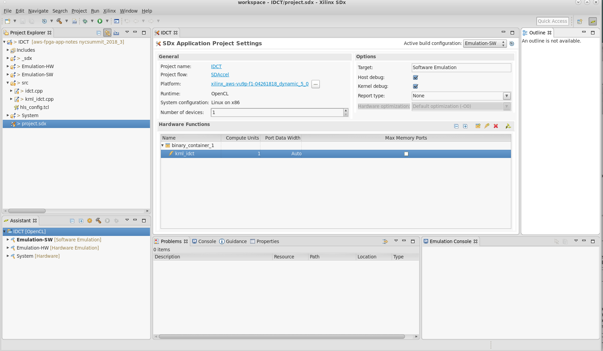
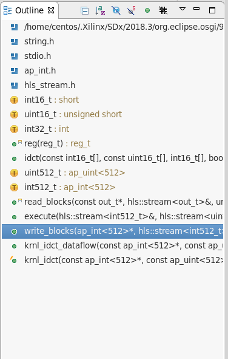
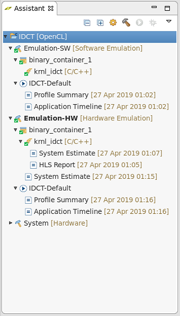
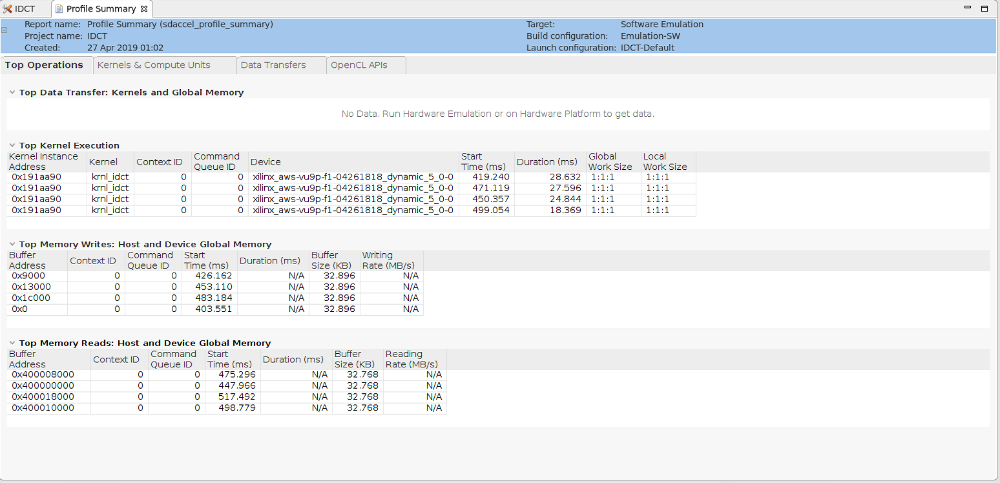
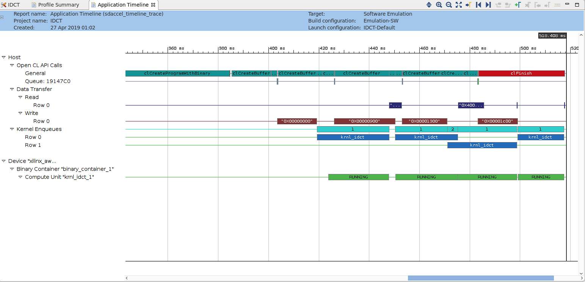
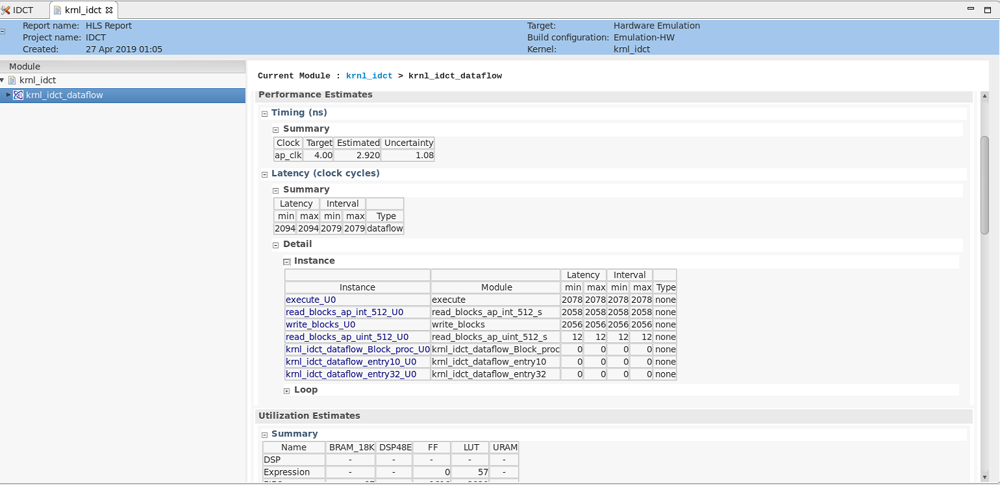

<table style="width:100%">
  <tr>
    <th width="100%" colspan="5"><h2>AWS Summit NYC 2018 Developer Workshop</h2></th>
  </tr>
  <tr>
    <td width="20%" align="center"><a href="README.md">Introduction</a></td>
    <td width="20%" align="center"><a href="SETUP.md">1. Connecting to your F1 instance</a></td> 
    <td width="20%" align="center"><a href="BLACK_SCHOLES_Lab.md">2. Experiencing F1 acceleration</a></td>
    <td width="20%" align="center"><b>3. Developing F1 applications</b></td>
    <td width="20%" align="center"><a href="WRAP_UP.md">4. Wrapping-up</td>
  </tr>
</table>
	
---------------------------------------
	
### Developing, profiling and optimizing F1 applications with SDAccel

This tutorial is designed to teach the fundamentals of the SDAccel development environment and programming model. This includes: familiarizing with OpenCL, understanding software and hardware emulation flows, profiling performance and identifying how to optimize host and kernel code. 

The kernel used in this tutorial is an Inverse Discrete Cosine Transform (IDCT), a function widely used in audio/image codecs such as HEVC. 

To simplify this tutorial, a workspace preloaded with the initial project configuration is provided in the workshop directory within the repository.

Please also note that although the entire tutorial is performed on an F1 instance, only the final step of this tutorial really needs to be run on F1. All the interactive development, profiling and optimization steps would normally be performed on-premise or on a cost-effective AWS EC2 instance such as C5 or Z1d. However, to avoid switching from other instance to F1 instances during this workshop, all the steps are performed on the F1 instance.

### Starting SDAccel

1.  Open a new terminal by right-clicking anywhere in the Desktop area and selecting **Open Terminal**. 

1.  Source the SDAccel environment  

    ```bash
    cd ~/aws-fpga
    source sdaccel_setup.sh
    cd ~
    ```
	*Note: the sdaccel_setup.sh script might generate warning messages, but these can be safely ignored.*


1. Launch the SDAccel GUI and open the predefined workspace containing the IDCT project: 
    ```bash
    sdx -workspace /home/centos/aws-fpga-app-notes/NYC_Summit18_Developer_Workshop/workspace
    ```
	*Note: a warning message may appear if loading Eclipse takes longer than expected. Click **Wait** to dismiss it.*

	The predefined workspace takes care of the following setup steps:
	* Creating a new project called **IDCT**
	* Adding the **xilinx_aws-vu9p-f1-04261818_dynamic_5_0** platform to the project and selecting it as the target for this project 
	* Importing the host (**idct.cpp**) and kernel (**krnl_idct.cpp**) source files
	* Setting the name of the FPGA binary container as **binary_container_1**
	* Setting the **krnl_idct** function to be a custom hardware function (also referred to as kernel).
	* Mapping the ports of the **krnl_idct** kernel to two different DDR memories; one for reads and one for writes. 
	* Setting **binary_container_1** to be the first argument passed to the host application when it is executed.	

	Most of this information is displayed in the **SDX Project Settings** window which is prominently displayed in the center of the GUI. It indicates the project name (**IDCT**), the selected platform (**xilinx_aws-vu9p-f1-04261818_dynamic_5_0**) and the FPGA binary container (**binary_container_1**) with the hardware function (**krnl_idct**).  
 
    

1. Familiarize yourself with the different sections of the GUI layout:
    * The **main menu** bar is located on the top. This menu bar allows direct access to all general project setup and GUI window management tasks. As most tasks are performed through the different setup windows, the main menu is mostly used to recover from accidently closed windows or to access the tool help.
    * Directly below the main menu bar is the **SDAccel toolbar**.  This provides access to the most common tasks in a project. From left to right, these are: File Management functions (new, save, save all), Configuration Management, Build, Build All, Start Debug, and Run. Most buttons have a default behavior as well as pulldowns.
    * The **Project Explorer** window occupies the top left hand side of the GUI. This window is used to manage and navigate through project files. In the expanded **src** folder you should be able to see the source files of the project. 
    * In the middle is the **SDx Project Settings** window. This window is intended for project management and presents the key aspects of an SDx Project. 
    * The **Outline** viewer on the right hand side is used for file navigation. The content of the outline varies depending on the file currently selected in the main window.
    * In the bottom left section is the **Assistant** window. This allows easy access to all reports generated by SDAccel. 
    * The remaining windows along the bottom of the main window accommodate the various consoles and terminals which contain output information relating to individual SDAccel executables. Typical output examples are compilation errors or the tool output when running.  

### Overview of the source code used in this example

1. Expand the **src** directory in the **Project Explorer**. 
	The project is comprised of two files:
	* **idct.cpp** contains the code for the host application running on the CPU.
	* **krnl_idct.cpp** contains the code for the kernel (custom accelerator) running on the FPGA.

1. Open the **krnl_idct.cpp** file.

1. Locate the **Outline** viewer located on the right side of the GUI. 
	* This view provides a convenient way of looking-up and navigating the code hierarchy. 
	* Each green dot in the **Outline** viewer corresponds to a function in the selected source file. 

    

1. In the **Outline** viewer, click **idct** to look-up this function. 
	* The **idct** function is the core algorithm implemented in the custom hardware accelerator.
	* This computationally heavy function can be highly parallelized on the FPGA, providing significant acceleration over a CPU-based implementation.

1. Using the **Outline** viewer, quickly look-up and inspect the other important functions of the accelerator:
	* The **krnl_idct** function is the top-level for the custom hardware accelerator. Interface properties for the accelerator are specified in this function.
	* The **krnl_idct_dataflow** function is called by the top-level function and encapsulates the main functions of the accelerator.
	* The **read_blocks** function reads from global memory values sent by the host application and streams them to the **execute** function.
	* The **execute** function receives the streaming data and, for each 8x8 block received, calls the **idct** function to perform the actual computation and streams the results back out.
	* The **write_blocks** function receives the streaming results from the **execute** function and writes them back to global memory for the host application.
	
1. Open the **idct.cpp** file (from the **src** folder of the **Project Explorer** view).  

1. Again, use the **Outline** viewer to quickly look-up and inspect the main functions of the host application:
	* The **main** function of the C++ program initializes the test vectors, sets-up OpenCL, runs the reference model, runs the hardware accelerator, releases the OpenCL resources, and compares the results of the reference IDCT model with the accelerator implementation.
	* The **runFPGA** function takes in a vector of inputs and, for each 8x8 block, calls the hardware accelerated IDCT using the **write**, **run**, **read**, and **finish** helper functions. These function use OpenCL API calls to communicate with the FPGA and are covered in greater detail later in this tutorial.
	* The **runCPU** function takes in a vector of inputs and, for each 8x8 block, calls **idctSoft**, a reference implementation of the IDCT .
	* The **idctSoft** function is the reference software implementation of the IDCT algorithm, used in this example to check the results coming back from the FPGA. 	
	* The **oclDct** class is used to encapsulate the OpenCL runtime calls to interact with the kernel in the FPGA. 
	* The **aligned_allocator**, **smalloc**, **load_file_to_memory**, and **getBinaryName** functions are small helper functions used during test vector generation and OpenCL setup.

1. Go to line 580 of the **idct.cpp** file by pressing **Ctrl+L** and entering **580**. 

	This section of code is where the OpenCL environment is setup in the host application. This section is typical of most SDAccel application and will look very familiar to developers with prior OpenCL experience. This body of code can often be reused as-is from project to project. 

	To setup the OpenCL environment, the following API calls are made:

	* **clGetPlatformIDs**: This function queries the system to identify the different OpenCL platforms. It is called twice as it first extracts the number of platforms before extracting the actual supported platforms.
	* **clGetPlatformInfo**: Get specific information about the OpenCL platform, such as vendor name and platform name.
	* **clGetDeviceIDs**: Obtain list of devices available on a platform.
	* **clCreateContext**: Creates an OpenCL context, which manages the runtime objects.
	* **clGetDeviceInfo**: Get information about an OpenCL device like the device name.
	* **clCreateProgramWithBinary**: Creates a program object for a context, and loads specified binary data into the program object. The actual program is obtained before this call through the load_file_to memory function.
	* **clCreateKernel**: Creates a kernel object.
	* **clCreateCommandQueue**: Create a command-queue on a specific device.

	Note: all objects accessed through a **clCreate...** function call are to be released before terminating the program by calling **clRelease...**. This avoids memory leakage and clears the locks on the device.

	All of the above API functions are documented by the [Khronos Group](https://www.khronos.org), the maintainers of OpenCL, the open standard for parallel programming of heterogeneous systems

### Running the Emulation Flows

SDAccel provides two emulation flows which allow testing the application before deploying on the F1 instance. The flows are referred to as software emulation (or Emulation-SW) and hardware emulation (or Emulation-HW), respectively.
* Software emulation is used to identify syntax issues and verify the behavior of application.
* Hardware emulation is used to get performance estimates for the accelerated application.

SDAccel uses Makefiles to perform incremental compilation of the project. This means that unless file changes require the recompilation of the host code or of the kernel code, no compilation is performed.

1. Return to the **SDx Project Settings** by clicking on **project.sdx** in the **Project Explorer** window (left side of the GUI).

1. In the upper right corner of the **SDx Project Settings** window, the **Active build configuration** is shown. Ensure that **Emulation-SW** is selected.

1. Click the **Run** button  to run software emulation.

	* In software emulation, both the host code and the kernel code are compiled to run on the x86 processor. 
	* This allows iterative algorithm refinement through fast build and run loops.
	* The **Console** provides the detailed build log during the compilation of the kernel and the host code. It then displays the standard output produced by the application during the actual emulation run.  
	* The software emulation is complete when the following messages are displayed at the bottom of the **Console**:

	```
	TEST PASSED
	RUN COMPLETE
	```	
	
1. In the **SDx Project Settings**, change the **Active build configuration** to **Emulation-HW**.

1. Click the **Run** button again or click **Ctrl+F11** to build and run the hardware emulation flow.

	* In hardware emulation, the host code is compiled to run on the x86 processor and the kernel code is compiled into a hardware model (known as RTL or Register Transfer Level) which is run in a special simulator.
	* The build and run cycle takes longer because the kernel code is compiled into a detailed hardware model which is slower to simulate.
	* The more detailed hardware simulation allow more accurate reporting of kernel and system performance.
	* This flow is also useful for testing the functionality of the logic that will go in the FPGA.
	* The hardware emulation is complete when the following messages are displayed at the bottom of the **Console**:
	
	```
	TEST PASSED
	RUN COMPLETE
	```

### Analyzing the Reports  

This section covers how to locate and read the various reports generated by the emulation runs. The goal of the section is to understand the analysis reports of SDAccel before utilizing them in the next section.  

1. Locate the **Assistant** window in the bottom-left corner of the GUI. 
	* This window displays a tree layout of folders and reports for all runs and open projects. 
	* The top level shows the **IDCT** project for which we have executed two runs: **Emulation-SW** and **Emulation-HW**.

    

1. Look into the **Emulation-SW** folder. 
	* The **IDCT-Default** run configuration folder contains the **Profile Summary** and **Application Timeline** report generated during the software emulation run.

1. Look into the **Emulation-HW** folder.
	* The **IDCT-Default** run configuration folder contains the **Profile Summary** and **Application Timeline** report generated during the hardware emulation run.
	* The **binary_container_1** folder contains the **HLS Report** from the compilation of the C++ kernel into the detailed hardware model (RTL). This compilation step is often referred to as High Level Synthesis or HLS.

1. Open the **Profile Summary** report from the **Emulation-SW** run. 

     

    _Note: in software emulation, profiling numbers may vary due to CPU and system loading._
    
    This report provides data related to how the application runs. Notice that the report has four tabs at the top: **Top Operations**, **Kernels & Compute Units**, **Data Transfers**, and **OpenCL APIs**. 
    
    Click through and inspect each of the tabs:

    * **Top Operations**: Shows all the major top operations of memory transfer between the host and kernel to global memory, and kernel execution. This allows you to identify throughput bottlenecks when transferring data. Efficient transfer of data to the kernel/host allows for faster execution times.
    
    * **Kernels & Compute Units**: Shows the number of times the kernel was executed. Includes the total, minimum, average, and maximum run times. If the design has multiple compute units, it will show each compute unit’s utilization. When accelerating an algorithm, the faster the kernel executes, the higher the throughput which can be achieved. It is best to optimize the kernel to be as fast as it can be with the data it requires.
    
    * **Data Transfers**: This tab has no bearing in software emulation as no actual data transfers are emulated across the host to the platform. In hardware emulation, this shows the throughput and bandwidth of the read/writes to the global memory that the host and kernel share.
    
    * **OpenCL APIs**: Shows all the OpenCL API command executions, how many time each was executed, and how long they take to execute.

1. Open the **Application Timeline** report from the **Emulation-SW** run. 

    	
       
    The **Application Timeline** collects and displays host and device events on a common timeline to help you understand and visualize the overall health and performance of your systems. These events include OpenCL API calls from the host code: when they happen and how long each of them takes.
    
1. Open the **Profile Summary** from the **Emulation-HW** run.

    

1. Locate the **Profile Rule Checks** section at the bottom of the **Profile Summary** 
    - **Profile Rule Checks** (PRCs) interpret profiling results and suggest areas for performance improvements.
    - PRCs compare profiling results to threshold values. If a check does not meet the threshold value, the right hand column provides guidance on how to improve performance.
    - PRCs work for both hardware emulation and system runs on the FPGA.

1. Click on the **Kernels & Compute Units** tab of the **Profile Summary** report, locate and note the following numbers:

    - Kernel Total Time (ms):

    This number will serve as reference point to compare against after optimization.    
    
1. Open the **HLS Report** from the **Emulation-HW** run.

    - The **HLS Report** is explains the results of compiling the kernel into hardware. It contains many details (including clocking, resources or device utilization) about the performance and logic usage of the custom-generated hardware logic. These details provide many insights to guide the kernel optimization process.    
    
    - For the needs of this tutorial, we will focus on the **Performance Estimates** section located in the middle of the main **Synthesis** tab. This section provides information on the latency of the kernel, as well as loop implementation details.  

1. In the left pane of the **HLS Report**, select the **krnl_idct_dataflow** function.

    

1. In the **Performance Estimates** section, locate the **Latency (clock cycles) > Summary** table and note the following numbers:

    - Latency (min/max):
    - Interval (min/max):

	The numbers will serve as a baseline for comparison against optimized versions of the kernel.

1. Right under the table, locate and expand the **Detail > Instance** sub-section.

	* Note that the 3 sub-functions read, execute and write have roughly the same latency and that their sum total is equivalent to the total Interval reported in the **Summary** table. 
	* This indicates that the three sub-functions are executing sequentially, hinting to an optimization opportunity.

1. Close all the reports by clicking the **X** in each of the report tabs.
 

### Optimization   

The previous section explained the SDAccel performance analysis capabilities. The next stage is to utilize these analysis capabilities to drive and measure code optimizations. This tutorial illustrates the DATAFLOW optimization for the kernel and software pipelining for the host application.


### Kernel Optimization  

Looking at the **HLS Report**, we identified that the read, execute and write functions of the **krnl_idct_dataflow** function have roughly the same latency and are executing sequentially. We still start by focusing on this performance aspect.

1. Open **krnl_idct.cpp** file (from the **Project Explorer** window).  

1. Using the **Outline** viewer, navigate to the **krnl_idct_dataflow** function.

1. Observe that the three functions are communicating using `hls::streams` objects. These objects model a FIFO-based communication scheme. This is the recommended coding style which should be used whenever possible to exhibit streaming behavior and allow DATAFLOW optimization.

1. Enable the DATAFLOW optimization by uncommenting the **#pragma HLS DATAFLOW** present in the **krnl_idct_dataflow** function (line 322). 
	
    - The DATAFLOW optimization allows each of the subsequent functions to execute as independent processes. 
    - This results in overlapping and pipelined execution of the read, execute and write functions instead of sequential execution.
    - The FIFO channels between the different processes do not need to buffer the complete dataset anymore but can directly stream the data to the next block. 

1. Comment out the three **#pragma HLS stream** statements on lines 327, 328 and 329.

1. Save the file (**Ctrl-S**).

1. Rebuild the **Emulation-HW** configuration of the project by clicking the  button.
	- The build process for hardware emulation takes a couple of minutes to run.

1. Open the new **HLS Report** (in the **Reports** view, open the **Emulation-HW** folder and expand the **binary_container_1** folder).

1. Compare the new latency numbers reported in the **Performance Estimates** section with the previous numbers and you will note considerable improvement based on the DATAFLOW optimization.  
    - Latency (min/max):
    - Interval (min/max):

1. Run the **Emulation-HW** flow by clicking the run button, . 

1. After the run finishes with the `RUN COMPLETE` message, open the new **Profile Summary** for the **Emulation-HW** run and select the **Kernels & Compute Units** tab.  

1. Compare the **Kernel Total Time (ms)** with the results from the unoptimized run.


### Host Code Optimization

1. Open **idct.cpp** file (from the **Project Explorer** window).  

1. Using the **Outline** viewer, navigate to the **runFPGA** function.

	For each block of 8x8 values, the **runFPGA** function writes data to the FPGA, runs the kernel, and reads results back. 
	
	Communication with the FPGA is handled by OpenCL API calls made within the cu.write, cu.run and cu.read functions.
	- **clEnqueueMigrateMemObjects** schedules the transfer of data to or from the FPGA.
	- **clEnqueueTask** schedules the executing of the kernel.

	These OpenCL functions use events to signal their completion and synchronize execution.
	
1. Open the **Application Timeline** of the **Emulation-HW** run.  

	The green segments at the bottom indicate when the IDCT kernel is running.

1. Notice that there are gaps between each of the green segments.

1. Zoom in by performing a **Left mouse drag** across one of these gaps to get a more detailed view.  

    

    - The two green segments correspond to two consecutive invocations of the IDCT kernel. 
    - The gap between the two segments is indicative of idle time between these two invocations. 
    - The **Data Transfer** section of the timeline shows that **Read** and **Write** operations are happening when the kernel is idle. 
    - The **Read** operation is to retrieve the results from the execution which just finished and the **Write** operation is to send inputs for the next execution. 
    - This represents a sequential execution flow of each iteration.  
    
1. Close the **Application Timeline**.    
	
1. In the **idct.cpp** file, go to the **oclDct::write** function.

	- Observe that on line 353, the function synchronizes on the **outEvVec** event through a call to **clWaitForEvents**. 
	- This event is generated by the completion of the **clEnqueueMigrateMemObjects** call in the **oclDct::read** function (line 429).
	- Effectively the next execution of the **oclDct::write** function is gated by the completion of the previous **oclDct::read** function, resulting in the sequential behavior observed in the **Application Timeline**. 
	
	
1. Use the **Outline** viewer to locate the definition of the **NUM_SCHED** macro in the **idct.cpp** file.
	
	- This macro defines the depth of the event queue.
	- The value of **1** explains the observed behavior: new tasks (write, run, read) are only enqueued when the previous has completed effectively synchronizing each loop iteration. 
	- By increasing the value of the **NUM_SCHED** macro, we increase the depth of the event queue and enable more blocks to be enqueued for processing. This will result in the write, run and read tasks to overlap and allow the kernel to execute continuously. 
	- This technique is called **software pipelining**. 
	
1. Modify line 213 to increase the value of **NUM_SCHED** to 6 as follows:
	```C
	#define NUM_SCHED 6
	```
1. Save the file (**Ctrl-S**) and rerun hardware emulation by clicking the run button . 

    - Since only the **idct.cpp** file was change, the incremental makefile rebuilds only the host code before running emulation.
    - This results in a much faster iteration loop since it is usually the compilation of the kernel to hardware which takes the most time.
    
1. Once completed, reopen the **Application Timeline** and observe how **software pipelining** enables overlapping of data transfers and kernel execution.

    
	
	Note: system tasks might slow down communication between the application and the hardware simulation, impacting on the measured performance results. The effect of software pipelining is considerably higher when running on the actual hardware. 

### Building the FPGA binary to execute on F1 

Once the application and kernel code have been optimized, the next step is to create an FPGA binary for execution on the F1 instance. 

Creating the FPGA binary is a two-step process:
* First SDAccel is used to build the Xilinx FPGA binary (.xclbin file).
* Then the AWS **create_sdaccel_afi.sh** script is used to create the AWS FPGA binary (.awsxclbin file) and register a secured and encrypted Amazon FPGA Image (AFI).

The **create_sdaccel_afi.sh** script does the following:
* Starts a background process to create the AFI
* Generates a \<timestamp\>_afi_id.txt which contains the FPGA Image Identifier (or AFI ID) and Global FPGA Image Identifier (or AGFI ID) of the generated AFI
* Creates the *.awsxclbin AWS FPGA binary file which is read by the host application to determine which AFI should be loaded in the FPGA.

These steps would take too long to complete during this tutorial, therefore a precompiled FPGA binary is used to continue this workshop and execute on F1.

### Executing on F1 

1. Close the SDAccel GUI and report to the terminal from which you started the tool.

1. Confirm that FPGA binary (.awsxclbin file) is indeed present.

	```bash
	# Go the workshop folder
	cd /home/centos/aws-fpga-app-notes/reInvent17_Developer_Workshop/idct
	
	# List contents of the ./xclbin directory to look for the .awsxclbin FPGA binary
	ls -la ./xclbin
	```

1. Retrieve the AFI Id from the krnl_idct_afi_id.txt file.
	
	```bash
	more ./xclbin/krnl_idct_afi_id.txt
	```	

1. Confirm that the AFI is ready and available using the retrieved AFI Id.

	``` bash
	aws ec2 describe-fpga-images --fpga-image-ids afi-028f76ef85d1042a9
	```
   
   The output of this command should contain:

    ``` json
    ...
    "State": {
        "Code": "available"
    },
    ...
    ```

1. Copy the host application executable built in the SDAccel workspace to the local directory and execute the accelerated application on F1 using the FPGA binary.

    ``` shell
    # Copy the host application executable
    cp /home/centos/aws-fpga-app-notes/NYC_Summit18_Developer_Workshop/workspace/IDCT/Emulation-HW/IDCT.exe .
   
    sudo sh
    # Source the SDAccel runtime environment
    source /opt/xilinx/xrt/setup.sh
    # Execute the host application with the .awsxclbin FPGA binary
    ./IDCT.exe ./xclbin/krnl_idct.hw.xilinx_aws-vu9p-f1-04261818_dynamic_5_0.awsxclbin
    ```

    Note the performance difference between the IDCT running on the CPU and the IDCT running in the FPGA.


### Summary  

In this workshop, you learned:
* Key features of the SDAccel development environment
* Important OpenCL API calls to communicate between the host and the FPGA
* The differences between the software and hardware emulation flows and how to run them
* How to read the various reports generated by SDAccel
* How to use pragmas to increase kernel performance
* How to use software pipelining to increase system performance
 
---------------------------------------

<p align="center"><b>
Start the next module: <a href="WRAP_UP.md">4. Wrap-up and Next Steps</a>
</b></p>  


