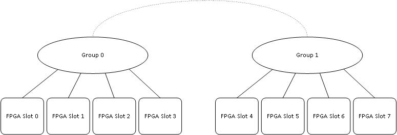

F1 FPGA Application Note

 # How to Use the PCIe Peer-2-Peer  Version 1.0 

 ## Table of Contents
<a name="introduction"></a>
 ## Introduction
 The purpose of this application note is to provide an F1 developer with information regarding PCIe Peer-2-Peer connectivity on f1.16xlarge and f1.4xlarge instances. This app note utilizes the PCIM interface for PCIe Peer-2-Peer transfers. See the [Using-PCIM-Port Application note](https://github.com/awslabs/aws-fpga-app-notes/tree/master/Using-PCIM-Port) for more information on the PCIM AXI Interface.
	
<a name="concepts"></a>
 ## Concepts
 The f1.16xlarge and f1.4xlarge instances have multiple FPGAs in a single instance, f1.16xl instance has 8 FPGAs and f1.4xl instance has 2 FPGAs per instance. The PCIe Peer-2-Peer feature enables a developer to directly access data between the FPGAs available on the same instance (f1.16xlarge and f1.4xlarge) without routing the requests through the host. This enhances solutions such as creating an accelerator that is composed of multiple FPGAs. Any FPGA on a f1.16xlarge or a f1.4xlarge instance can directly access data located on another FPGA (peer-to-peer) on the same instance. Data transfers between the F1 FPGAs must target the ApplicationDevice/Bar4 (128G BAR). On f1.16xlarge or f1.4xlarge instances, a FPGA can directly transfer data to another FPGA on the same instance. 

 The f1.16xlarge instance has 8 FPGAs, and these FPGAs are classified into two groups, each group consisting of 4 FPGAs. 
 1. Group1: 
      1. Slot0 (0000:00:0f.0)
      2. Slot1 (0000:00:11.0)
      3. Slot2 (0000:00:13.0)
      4. Slot3 (0000:00:15.0) 
      
 2. Group2:
      1. Slot4 (0000:00:17.0)
      2. Slot5 (0000:00:19.0)
      3. Slot6 (0000:00:1b.0)
      4. Slot7 (0000:00:1d.0)

FPGAs within a group can directly access other FPGAs within the same group and can yield high performance.  Accesses between groups is not direct and not optimal (higher latency, lower bandwidth).



The f1.4xlarge instance has 2 FPGAs in a single instance, both the FPGAs are in the same group. 
1. Slot0 (0000:00:1b.0)
2. Slot1 (0000:00:1d.0)

 This application note uses the CL_DRAM_DMA example design to demonstrate the Peer-2-Peer transfers on a f1.16xlarge/f1.4xlarge instance. The example design contains an Automatic Test Pattern Generator (ATG) that is connected to the PCIM port. The ATG represents an accelerator that can produce or consume data. The ATG is an AXI-4 master exerciser that is able to issue write requests, read requests, and compare written vs. read data. To access another F1 FPGA on the same f1.16xlarge/f1.4xlarge instance, software must obtain the physical address of the target F1 FPGA, ApplicationDevice/Bar4 (128G Bar) and program this address into the ATG.

<a name="restrictions"></a>
 ### Peer-2-Peer Restrictions
 1. Peer-2-Peer transfers to the F1 ApplicationDevice/Bar4 (128G Bar) targetting the same F1 FPGA (source and destination FPGA of the transfer are the same FPGA) are not allowed, and these transfers are blocked.  *CAUTION* this will result in errant behavior. 
 2. Peer-2-Peer transfers can only target the F1 ApplicationDevice/Bar4 (128G Bar). Peer-2-Peer accesses to other BARs are blocked.  *CAUTION* This will result in errant behavior.

<a name="recommendations"></a>
 ### Peer-2-Peer Recommendations
1. For performance reasons on f1.16xlarge instances, it is recommended to only use Peer-2-Peer among FPGAs in the same Group (i.e. either among F1 FPGAs in Group1 or among F1 FPGAs in Group2). Peer-2-Peer transfers among F1 FPGAs of different groups is not recommended.
2. For transfers between F1 FPGAs on different groups of a f1.16xlarge instance, transfer data from the source FPGA to host memory, and then from host memory to the target F1 FPGA.

<a name="physical"></a>
 ### Finding the Physical Address for ApplicationDevice/Bar4 Region (128G BAR)

 To perform Peer-2-Peer transfers from an initiating F1 FPGA to a target F1 FPGA (ApplicationDevice/Bar4 (128G Bar)) on a f1.16xlarge/ f1.4xlarge instances, the source FPGA needs to know the physical address of the target FPGA, ApplicationDevice/Bar4. Using the lspci command in verbose mode for the ApplicationDevice of the target F1 FPGA will list all the bars with their physical addresses. Only the 128G user bar is available for Peer-2-Peer transfers, all the other Bars are disabled for Peer-2-Peer transfers.

 ```
 $ sudo lspci -vv -s 0000:00:0f.0  # 16xL, Slot 0 
 ```
 The command will produce output similar to the following (note RegionX is the same as BarX, so Bar4 is what is labeled as Region 4):
 ```
 #16xL

 00:0f.0 Memory controller: Device 1d0f:f001
        Subsystem: Device fedc:1d51
        Physical Slot: 15
        Control: I/O- Mem+ BusMaster+ SpecCycle- MemWINV- VGASnoop- ParErr- Stepping- SERR- FastB2B- DisINTx-
        Status: Cap+ 66MHz- UDF- FastB2B- ParErr- DEVSEL=fast >TAbort- <TAbort- <MAbort- >SERR- <PERR- INTx-
        Latency: 0
        Region 0: Memory at c4000000 (32-bit, non-prefetchable) [size=32M]
        Region 1: Memory at c6000000 (32-bit, non-prefetchable) [size=2M]
        Region 2: Memory at 5e000410000 (64-bit, prefetchable) [size=64K]
        Region 4: Memory at 5c000000000 (64-bit, prefetchable) [size=128G]
 ```
 Region 4, Bar Address 5c000000000 can be used as the target address by any other FPGA on the f1.16xlarge instance, to access the FPGA 00:0f.0 for Peer-2-Peer accesses. An FPGA cannot access itself i.e. FPGA 00:0f.0 cannot access Address 5c000000000.
Software can access the various Region's (BAR), physical Address using the PCIe Device resource file.
```
  char [256] sysfs_name;
  sysfs_name = ?/sys/bus/pci/devices/0000:00:0f:0/resource?;
  FILE *fp = fopen(sysfs_name, ?r?);
  for (size_t i = 0; i < FPGA_BAR_PER_PF_MAX; ++i) {
    uint64_t addr_begin = 0, addr_end = 0, flags = 0;
    ret = fscanf(fp, "0x%lx 0x%lx 0x%lx\n", &addr_begin, &addr_end, &flags);
  }
```
The 0000:00:0f.0 is the PCIe ```Domain:bus:device:function``` of the F1.16xlarge FPGA Slot 0.

<a name="ocl"></a>
 ### Accessing the AppPF Bar 0 Region (OCL BAR)
 The FPGA that will be initiating the Peer-2-Peer transfers will use the ATG which is connected to the PCIM interface. The ATG Registers are located on the OCL interface of the CL. The OCL interface is mapped to Region 0 (Bar0).  Accesses to this region will produce AXI transactions on the OCL interface of the CL. To gain access to this region, the memory must be mapped into the user address space of the application. The FPGA library's function, fpga_pci attach, performs this operation and stores the information in a structure.

 ```
 rc = fpga_pci_attach(slot_id, pf_id, bar_id, 0, &pci_bar_handle);  # bar_id = 0

 ```
 Four input arguments are necessary: 
 1. The slot number
 2. The physical function
 3. The bar/region 
 4. The write combining flag 

The OCL Region does not support write combining and so this argument is 0. The function uses these arguments to open the appropriate sysfs file. For example, calling the function with following arguments:

 ```
 rc = fpga_pci_attach(0, 0, 0, 0, &pci_bar_handle);
 ```
 opens the sysfs file:  /sys/bus/pci/devices/0000:00:0f.0/resource0.

<a name="details"></a>
 ### Peer-2-Peer example details

 The F1 Peer-2-Peer example demonstrates Peer-2-Peer transfers between all the FPGAs of the f1.16xlarge (8 FPGAs) or f1.4xlarge (2 FPGAs) instance.  The example performs writes and read/compares to verify the data. The example takes an argument ?instance_type(-I), based on the instance type the test will be performing data transfers between different FPGAs.

 In the example for a f1.16xlarge instance there are two loops of Peer-2-Peer transfers (one loop per FPGA group):
```
 Loop1:
    1. FPGA Slot0 performs a Peer-2-Peer write transfer of 64 bytes to FPGA Slot1
    2. FPGA Slot1 performs a Peer-2-Peer write transfer of 64 bytes to FPGA Slot2
    3. FPGA Slot2 performs a Peer-2-Peer write transfer of 64 bytes to FPGA Slot3
    4. FPGA Slot3 performs a Peer-2-Peer write transfer of 64 bytes to FPGA Slot0

 Loop2: 
    1. FPGA Slot4 performs a Peer-2-Peer write transfer of 64 bytes to FPGA Slot5
    2. FPGA Slot5 performs a Peer-2-Peer write transfer of 64 bytes to FPGA Slot6
    3. FPGA Slot6 performs a Peer-2-Peer write transfer of 64 bytes to FPGA Slot7
    4. FPGA Slot7 performs a Peer-2-Peer write transfer of 64 bytes to FPGA Slot4
```
 
In the example for a f1.4xlarge instance there is a single loop of Peer-2-Peer transfers (there is only a single group on f1.4xlarge):

```
  Loop1:
    1. FPGA Slot0 performs a Peer-2-Peer write transfer of 64 bytes to FPGA Slot1
    2. FPGA Slot1 performs a Peer-2-Peer write transfer of 64 bytes to FPGA Slot0
``` 

 After each write, a Peer-2-Peer read is performed to verify the data.  This example simulates a pipeline design where FPGA passes information to the next FPGA via writes.  The reads simulate some status read of the next FPGA.

 
 The example first checks that the correct AFI is loaded for the test.
 ```
    /* check that the AFI is loaded /
    log_info("Checking to see if the right AFI is loaded...");
    for (int slot_id=0; slot_id < MAX_SLOTS; slot_id++) {
       rc = check_slot_config(slot_id);
       fail_on(rc, out, "slot config is not correct");
    }
 ```

 The OCL(Region0) Bar for all FPGAs of the f1.16xlarge or f1.4xlarge instance are made acessible using the fpga management library function `fpga_pci_attach`.

 ```
    /* pci_bar_handle_t is a handler for an address space exposed by one PCI BAR on one of the PCI PFs of the FPGA */
    for (int slot_id=0; slot_id < num_slots; slot_id++) {
       pci_bar_handle[slot_id] = PCI_BAR_HANDLE_INIT;

       bar_id =0;
       /* Attaching to OCL Bar */
       rc = fpga_pci_attach(slot_id, pf_id, bar_id, 0, &pci_bar_handle[slot_id]);
       fail_on(rc, out, "Unable to attach to the OCL Bar AFI on slot id %d", slot_id);

       address[slot_id] = get_128GBar_address(resource_name[slot_id]);
    }
 ```

 The function `get_128GBar_address` is used to get the physical address of the F1 Application Device, BAR4 (128G Bar). `num_slot` is 2 for f1.4xlarge and 8 for f1.16xlarge.

 ```
 uint64_t get_128GBar_address(char *dir_name)
 {
        int ret;
        uint64_t physical_addr;
        fail_on(!dir_name, err, "dir_name is null");

        char sysfs_name[256];
        ret = snprintf(sysfs_name, sizeof(sysfs_name),
                        "/sys/bus/pci/devices/%s/resource", dir_name);
        fail_on(ret < 0, err, "Error building the sysfs path for resource");
        fail_on((size_t) ret >= sizeof(sysfs_name), err,
                        "sysfs path too long for resource");

        FILE *fp = fopen(sysfs_name, "r");
        fail_on_quiet(!fp, err, "Error opening %s", sysfs_name);

        for (size_t i = 0; i < FPGA_BAR_PER_PF_MAX; ++i) {
                uint64_t addr_begin = 0, addr_end = 0, flags = 0;
                ret = fscanf(fp, "0x%lx 0x%lx 0x%lx\n", &addr_begin, &addr_end, &flags);
                if (ret < 3 || addr_begin == 0) {
                        continue;
                }
                if (i == 4) {
                  physical_addr = addr_begin;
                }
        }

        fclose(fp);
        return physical_addr;
 err:
        errno = 0;
        return FPGA_ERR_FAIL;
 }

 ```
 And then the Peer-2-Peer transfers are performed for each group.

 ```
    for (int Group_id=0; Group_id < GROUP; Group_id++) {
       log_info("INFO: Starting the Peer-2-Peer transfers in between Group%d", Group_id);
       for (int slot=0; slot < (num_slot/group); slot++) {
          slot_id = Group_id*4 + slot;
          tgt_slot_id = Group_id*4 + (slot+1);
          if (((num_slot == 8) & ((slot_id == 3) | (slot_id == 7))) | ((num_slot == 2) & (slot_id == 1))) {
             tgt_slot_id = Group_id*4 + (0);
          }
             log_info("INFO: Starting P2P transfer from slot %d to slot%d Address %lx", slot_id, tgt_slot_id, address[tgt_slot_id]);
             rc = p2p_write(pci_bar_handle[slot_id], address[tgt_slot_id], test_pattern);
             sleep(1);
             rc = p2p_read_compare(pci_bar_handle[slot_id], address[tgt_slot_id], test_pattern);
             fail_on(rc, out, "Read Compare failed for the ATG");
       }
    } 
 
 ```

<a name="compiling"></a>
 ### Compiling and Running the Peer-2-Peer example

 To run this example: 

 launch a f1.16xlarge/f1.4xlarge instance 

 clone the [aws-FPGA Github repository](https://github.com/aws/aws-FPGA/blob/master/README.md)

 download the latest app note files in [aws-FPGA-app-notes Github repository](https://github.com/awslabs/aws-FPGA-app-notes/blob/master/README.md)

 install the FPGA Management tools by sourcing the sdk_setup.sh script in the aws-FPGA repository.

 change directory to the app note directory

 ```
    $ git clone https://github.com/aws/aws-FPGA.git
    $ git clone https://github.com/awslabs/aws-FPGA-app-notes.git
    $ cd aws-FPGA
    $ source sdk_setup.sh
    $ cd ../aws-FPGA-app-notes/Using-PCIe-Peer2Peer/
 ```


 Use the `FPGA-load-local-image` command to load the FPGA with the pre-generated [CL_DRAM_DMA AFI](https://github.com/aws/aws-FPGA/blob/master/hdk/cl/examples/cl_dram_dma/README.md).  Load the AFI on All the slots.

 ```
 $ for i in {0..7}; do sudo fpga-load-local-image -S $i -I agfi-0d132ece5c8010bf7; done #16xL
 ```
```
 $ for i in {0..1}; do sudo fpga-load-local-image -S $i -I agfi-0d132ece5c8010bf7; done #4xL
```


 Verify the Bus Master Enable is set on all the FPGAs.  This enables the devices to perform bus mastering operations:

```
 $ for f1 in 0f 11 13 15 17 19 1b 1d; do sudo lspci -vv -s 0000:00:$f1.0 | grep BusMaster; done #16xL
```
```
 $ for f1 in 1b 1d; do sudo lspci -vv -s 0000:00:$f1.0 | grep BusMaster; done #4xL
```


 Check to make sure the output displays ``BusMaster+`` on all FPGAs.  If the Bus Master Enable is disabled, it can be enabled by:

 ```
 $ for f1 in 0f 11 13 15 17 19 1b 1d; do sudo setpci -v -s 0000:00:$f1.0 COMMAND=06; done #16xL
 ```
```
 $ for f1 in 1b 1d; do sudo setpci -v -s 0000:00:$f1.0 COMMAND=06; done #4xL
 ```

 Compile the test program.
 ```
 $ make       # compiles the test program
 ```
 Run the compiled test program.
 ```
 $ sudo ./test_p2p -I $(curl http://169.254.169.254/latest/meta-data/instance-type)
```
 ```
$ sudo ./test_p2p -I $(curl http://169.254.169.254/latest/meta-data/instance-type)

 2019-09-30T14:49:01.431362Z, test_p2p, INFO, test_p2p.c +100: main(): Checking to see if the right AFI is loaded...
 2019-09-30T14:49:01.446610Z, test_p2p, INFO, test_p2p_common.c +134: check_slot_config(): Operating on slot 0 with id: 0000:00:0f.0
 2019-09-30T14:49:01.472292Z, test_p2p, INFO, test_p2p_common.c +134: check_slot_config(): Operating on slot 1 with id: 0000:00:11.0
 2019-09-30T14:49:01.484655Z, test_p2p, INFO, test_p2p_common.c +134: check_slot_config(): Operating on slot 2 with id: 0000:00:13.0
 2019-09-30T14:49:01.510381Z, test_p2p, INFO, test_p2p_common.c +134: check_slot_config(): Operating on slot 3 with id: 0000:00:15.0
 2019-09-30T14:49:01.533783Z, test_p2p, INFO, test_p2p_common.c +134: check_slot_config(): Operating on slot 4 with id: 0000:00:17.0
 2019-09-30T14:49:01.546374Z, test_p2p, INFO, test_p2p_common.c +134: check_slot_config(): Operating on slot 5 with id: 0000:00:19.0
 2019-09-30T14:49:01.572060Z, test_p2p, INFO, test_p2p_common.c +134: check_slot_config(): Operating on slot 6 with id: 0000:00:1b.0
 2019-09-30T14:49:01.584616Z, test_p2p, INFO, test_p2p_common.c +134: check_slot_config(): Operating on slot 7 with id: 0000:00:1d.0
 2019-09-30T14:49:01.600777Z, test_p2p, INFO, test_p2p.c +153: p2p_example(): INFO: Starting the P2P test
 2019-09-30T14:49:01.600789Z, test_p2p, INFO, test_p2p.c +156: p2p_example(): INFO: Starting the Peer-2-Peer transfers in between Group0
 2019-09-30T14:49:01.600793Z, test_p2p, INFO, test_p2p.c +163: p2p_example(): INFO: Starting P2P transfer from slot 0 to slot1
 2019-09-30T14:49:01.600798Z, test_p2p, INFO, test_p2p.c +188: p2p_write(): INFO: Writing write instructions for write transfers
 2019-09-30T14:49:01.600801Z, test_p2p, INFO, test_p2p.c +194: p2p_write(): INFO: Write Instruction: index 0 Address 58000000000 Data f1f1f1f1 length 0
 2019-09-30T14:49:01.600806Z, test_p2p, INFO, test_p2p.c +207: p2p_write(): INFO: Configuring the ATG
 2019-09-30T14:49:01.600809Z, test_p2p, INFO, test_p2p.c +214: p2p_write(): INFO: Starting the ATG to do write only transfers
 2019-09-30T14:49:02.601005Z, test_p2p, INFO, test_p2p.c +232: p2p_read_compare(): INFO: Writing read instructions for read transfers
 2019-09-30T14:49:02.601053Z, test_p2p, INFO, test_p2p.c +238: p2p_read_compare(): INFO: Read Instruction: index 0 Address 58000000000 Data f1f1f1f1 length 0
 2019-09-30T14:49:02.601079Z, test_p2p, INFO, test_p2p.c +253: p2p_read_compare(): INFO: Configuring the ATG
 2019-09-30T14:49:02.601083Z, test_p2p, INFO, test_p2p.c +260: p2p_read_compare(): INFO: Starting the ATG to do read only transfers
 2019-09-30T14:49:03.601269Z, test_p2p, INFO, test_p2p.c +266: p2p_read_compare(): INFO: Checking Read Error Status Register
 2019-09-30T14:49:03.601312Z, test_p2p, INFO, test_p2p.c +270: p2p_read_compare(): INFO: Read Error status Register Value is 0
 2019-09-30T14:49:03.601321Z, test_p2p, INFO, test_p2p.c +271: p2p_read_compare(): INFO: Read Bresp Error Register Value is 0
 2019-09-30T14:49:03.601328Z, test_p2p, INFO, test_p2p.c +272: p2p_read_compare(): INFO: Read Rresp Error Register Value is 0
 2019-09-30T14:49:03.601335Z, test_p2p, INFO, test_p2p.c +163: p2p_example(): INFO: Starting P2P transfer from slot 1 to slot2
 2019-09-30T14:49:03.601344Z, test_p2p, INFO, test_p2p.c +188: p2p_write(): INFO: Writing write instructions for write transfers
 2019-09-30T14:49:03.601351Z, test_p2p, INFO, test_p2p.c +194: p2p_write(): INFO: Write Instruction: index 0 Address 54000000000 Data f1f1f1f1 length 0
 2019-09-30T14:49:03.601360Z, test_p2p, INFO, test_p2p.c +207: p2p_write(): INFO: Configuring the ATG
 2019-09-30T14:49:03.601368Z, test_p2p, INFO, test_p2p.c +214: p2p_write(): INFO: Starting the ATG to do write only transfers
 2019-09-30T14:49:04.601540Z, test_p2p, INFO, test_p2p.c +232: p2p_read_compare(): INFO: Writing read instructions for read transfers
 2019-09-30T14:49:04.601556Z, test_p2p, INFO, test_p2p.c +238: p2p_read_compare(): INFO: Read Instruction: index 0 Address 54000000000 Data f1f1f1f1 length 0
 2019-09-30T14:49:04.601561Z, test_p2p, INFO, test_p2p.c +253: p2p_read_compare(): INFO: Configuring the ATG
 2019-09-30T14:49:04.601564Z, test_p2p, INFO, test_p2p.c +260: p2p_read_compare(): INFO: Starting the ATG to do read only transfers
 2019-09-30T14:49:05.601721Z, test_p2p, INFO, test_p2p.c +266: p2p_read_compare(): INFO: Checking Read Error Status Register
 2019-09-30T14:49:05.601740Z, test_p2p, INFO, test_p2p.c +270: p2p_read_compare(): INFO: Read Error status Register Value is 0
 2019-09-30T14:49:05.601744Z, test_p2p, INFO, test_p2p.c +271: p2p_read_compare(): INFO: Read Bresp Error Register Value is 0
 2019-09-30T14:49:05.601747Z, test_p2p, INFO, test_p2p.c +272: p2p_read_compare(): INFO: Read Rresp Error Register Value is 0
 ```
 Figure 1. Snippet of Peer-2-Peer Test Program Output for a f1.16xl instance.


<a name="further"></a>
 ## For Further Reading

 ### AWS F1 FPGA Developer's Kit (https://github.com/aws/aws-FPGA)
 ### AWS F1 Shell Interface Specification (https://github.com/aws/aws-FPGA/blob/master/hdk/docs/AWS_Shell_Interface_Specification.md)

 ### Using the PCIM Interface Application Note (https://github.com/awslabs/aws-FPGA-app-notes/tree/master/Using-PCIM-Port)

 ### How To Write Linux PCI Drivers (https://www.kernel.org/doc/Documentation/PCI/pci.txt)

 ## Revision History

 |     Date      | Version |     Revision    |   Shell    |   Developer   |
 | ------------- |  :---:  | --------------- |   :---:    |     :---:     |
 | Sep. 30, 2019 |   1.0   | Initial Release | 0x04261818 | K. Shah | 
 | Jul. 14, 2020 |   1.1   | P2P 4xl update  | 0x04261818 | K. Shah |
|


