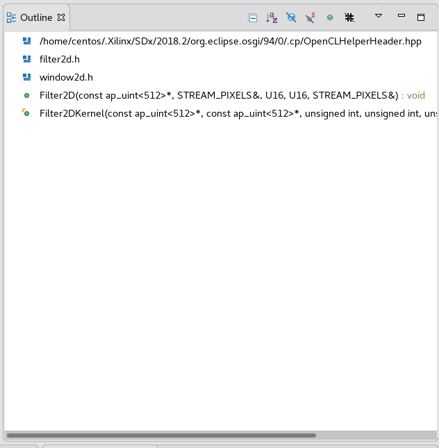

<table style="width:100%">
  <tr>
    <th width="100%" colspan="6"><h2>re:Invent 2018 Developer Workshop</h2></th>
  </tr>
  <tr>
    <td width="20%" align="center"><a href="README.md">Introduction</a></td>
    <td width="20%" align="center"><a href="SETUP.md">1. Connecting to your F1 instance</a></td> 
    <td width="20%" align="center"><a href="SDAccelGUI_INTRO.md">2. Developing an Application using SDAccel GUI</a></td>
	<td width="20%" align="center"><b>3. Developing F1 applications</b></td>
    <td width="20%" align="center"><a href="HOSTCODE_OPT.md">4. Host Code Optimization</a></td>
    <td width="20%" align="center"><a href="WRAP_UP.md">5. Wrapping-up</td>
  </tr>
</table>
	
---------------------------------------
	
### Developing, profiling and optimizing F1 applications with SDAccel

This tutorial is designed to teach the fundamentals of the SDAccel development environment and programming model. 

The kernel used in this tutorial is a 2D video filter, a function widely used in video processing algorithms such as noise reduction, and image sharpening. 

Please also note that although the entire tutorial is performed on an F1 instance, only the final step of this tutorial really needs to be run on F1. All the interactive development, profiling and optimization steps can be performed on a cost-effective AWS EC2 instance such as T3 or any other instance supported by AWS FPGA Developer AMI. Alternately, Development can also be done using on-premise systems that has Xilinx VIVADO & SDx Tools installed. However, to avoid switching instances during this tutorial, all the steps are performed on the F1 instance.

### Starting SDAccel

1. Open a new terminal by right-clicking anywhere in the Desktop area and selecting **Open Terminal**. 

1. Source the SDAccel environment   

    ```bash
    cd ~/aws-fpga
    source sdaccel_setup.sh
    cd ~
    ```
	*Note: the sdaccel_setup.sh script might generate warning messages, but these can be safely ignored.*

1. Navigate to the Lab directory: 
    ```bash
    cd ~/aws-fpga-app-notes/reInvent18_Developer_Workshop/filter2D
    ```

### Overview of source code files used in this example

1. Expand the **src** directory in the **Project Explorer**. 
The project is comprised of two directories:
	* **host** contains the code for the host application running on the CPU.
	* **kernel** contains the code for the kernel (custom accelerator) running on the FPGA.

1. Expand the **host** directory in the **Project Explorer**. 
The host code is comprised of the following files:
	* **host.cpp** - main application code.
	* **filter2d.cpp**, **filter2d.h**, **coefficients.h** and **window2d.h** - code for the filter function running on the CPU.
	* **xclbin_helper.cpp** and **xclbin_helper.h** - helper code for downloading accelerators to the FPGA.
	* **cmdlineparser.cpp** and **cmdlineparser.h** - code for parsing command line arguments.
	* **logger.cpp** and **logger.h** - code for logging information.

1. Expand the **kernel** directory in the **Project Explorer**. 
The kernel code is comprised of the following files:
	* **filter2d.cpp** and **filter2d.h** - code for the filter function running on the FPGA.
	* **axi2stream.cpp** and **axi2stream.h** - code for efficiently reading from and writing to memory.
	* **window_2d.h** and **hls_video_mem.h** - code for handling video line buffers and pixel windows.

### Overview of the kernel code

1. Now double-click on the **filter2d.cpp** file in the **src/kernel** folder to open it.

1. Locate the **Outline** viewer located on the right side of the GUI. 
	* This view provides a convenient way of looking-up and navigating the code hierarchy. 
	* Each green dot in the **Outline** viewer corresponds to a function in the selected source file. 

	

1. In the **Outline** viewer, click **Filter2DKernel** to look-up this function. 
	* The **Filter2DKernel** function is the top-level of the filter kernel implemented in the custom hardware accelerator. Interface properties for the accelerator are specified in this function. This computationally heavy function can be highly parallelized on the FPGA, providing significant acceleration over a CPU-based implementation.
	* The kernel encapsulates the three main functions of the accelerator: **AXIBursts2PixelStream**, **Filter2D**, and **PixelStream2AXIBursts**.
		* The **AXIBursts2PixelStream** function reads from global memory values sent by the host application and streams them to the **Filter2D** function.
		* The **Filter2D** function receives the pixel data and performs the actual filter computations, and streams the results to the next function
		* The **PixelStream2AXIBursts** function receives the streaming results from the **Filter2D** function and writes them back to global memory for the host application.
	* Observe that the three functions are communicating using `hls::stream` objects. These objects model a FIFO-based communication scheme. This is the recommended coding style which should be used whenever possible to provide streaming behavior and allow DATAFLOW optimization.
		- The DATAFLOW optimization allows each of the subsequent functions to execute as independent processes. 
		- This results in overlapping and pipelined execution of the read, execute and write functions instead of sequential execution.
		- The FIFO channels between the different processes do not need to buffer the complete dataset anymore but can directly stream the data to the next block. 
	* Note that the **Filter2D** kernel processes only a single color plane. At compile time, we can choose to have 1 or many kernels in the FPGA. 
		- When there is only 1 kernel in the FPGA, a planar formatted YUV 4:4:4 image will have its luma and chroma planes procesed sequentially. 
		- When there are 3 kernels in the FPGA, the luma and both chroma planes can be processed in parallel, therefore having a higher performance, at the cost of more FPGA resources. We will get back to this later in the lab.

1. Using the **Outline** viewer, quickly look-up and inspect the other important functions of the accelerator:
	* The **Filter2D** function is the heart of the custom hardware accelerator that peforms the filter computations.
	* It uses the **Window2D** class that provides an abstraction for getting a two-dimensional pixel window, then performs a simple convolution of the pixels in this window with a programmable filter.
	* Note the ```#pragma HLS PIPELINE II=1``` statement on line 26. This pragma tells the compiler that a new iteration of the for loop should be started exactly one clock cycle after the previous one.  As a result, the SDAccel compiler builds an accelerator with 15*15=225 multipliers. Where the 225 multiply-add operations of the 2D convolution would be executed sequentially on a conventional CPU architecture, they are executed in parallel in the purpose-built FPGA accelerator. This results in a significant performance improvement.  
	
### Overview of the host application code
	
1. Open file **host.cpp** from the **src/host** folder of the **Project Explorer** view.  
	* This C++ program initializes the test vectors, sets-up OpenCL, runs the reference model, runs the hardware accelerator, releases the OpenCL resources, and compares the results of the reference Filter2D model with the accelerator implementation.
	
1. Go to line 215 of the **host.cpp** file by pressing **Ctrl+L** and entering **215**. The **load_xclbin_file** function is where the OpenCL environment is setup in the host application. 

1. Using the right mouse button, click on the **load_xclbin_file** function and chose **Open Declaration** to jump to the declaration of the function located in the **xclbin_helper.cpp** file.
	* This function takes care of retrieving the OpenCL platform, device ID, creating the OpenCL context and create the OpenCL program. These four steps are typical of all SDAccel application.
	* The functions implementing these four steps (also located in the **xclbin_helper.cpp** file) will look very familiar to developers with prior OpenCL experience. This code can often be reused as-is from project to project. 
	* Of particular note is the call to **clCreateProgramWithBinary** (line 87). This function loads contents of the specified FPGA binary file (.xclbin or .awsxclbin file) into the FPGA device of the AWS EC2 F1 instance. 
	* All objects accessed through a **clCreate...** function call are to be released before terminating the program by calling **clRelease...**. This avoids memory leakage and clears the lock on the device.

1. Now go back to the **host.cpp** file and go to line 309. This where the image is processed using a conventional software implementation.
	* Line 322-324, the **Filter2D** function is called 3 times to process the Y, U and V color planes of the image, respectively.
	* Line 318, the OpenMP ```#pragma omp parallel for``` pragma is used to multi-thread the calls to the **Filter2D** function. This ensures a fair benchmark comparison betweem the CPU and FPGA executions.

1. Scroll upwards to line 263. This is where the image is processed using the FPGA accelerator.
	* Notice how this code looks very similar to the software implementation you just inspected. 
	* Line 279-281, the **Filter()** operator is used to issue independent requests to process the Y, U and V color planes using the FPGA accelerator.
	* **Filter** is declared line 269 as an object of type **Filter2DDispatcher**. The **Filter2DDispatcher** class encapsulates the necessary OpenCL API calls used to send requests to the hardware accelerated Filter2DKernel.

1. Click on **Filter2DDispatcher** and press **F3** to go to the declaration of the class.

	The class constructor (line 85) creates the OpenCL objects required to communicate with the FPGA accelerator: 
	* **clCreateKernel** is used to create the kernel object.
	* **clCreateCommandQueue** is used to create the command-queue used to send commands to the FPGA device.  

	The overloaded ```()``` operator (line 96) is used to form and send requests to the accelerator.
	* **clCreateBuffer** calls are used to create the input and output memory buffers.
	* **clEnqueueMigrateMemObjects** calls are used to schedule the transfer of the input buffers to the FPGA device and then transfer the output buffer back to the host.
	* **clSetKernelArg** calls are used to set the arguments of the kernel.
	* **clEnqueueTask** is used to schedule the execution of the kernel.
	* **clSetEventCallback** is used to register a user callback function, which in this case, simply prints a message when transfer of the output buffer back to the host is complete.

	All of the above API functions are documented by the [Khronos Group](https://www.khronos.org), the maintainers of OpenCL, the open standard for parallel programming of heterogeneous systems


### Running the Emulation Flows

SDAccel provides two emulation flows which allow testing the application before deploying on the F1 instance. The flows are referred to as **software emulation** (or Emulation-CPU) and **hardware emulation** (or Emulation-HW), respectively.
* Software emulation is used to identify syntax issues and verify the functional behavior of the application.
	* In software emulation, both the host code and the kernel code are compiled to run on the x86 processor. 
	* This allows iterative algorithm refinement through fast build and run loops.
* Hardware emulation is used to get performance estimates for the accelerated application.
	* In hardware emulation, the host code is compiled to run on the x86 processor and the kernel code is compiled into a hardware model (known as RTL or Register Transfer Level) which is run in a special simulator.
	* The build and run cycle takes longer because the kernel code is compiled into a detailed hardware model which is slower to simulate.
	* The more detailed hardware simulation allows more accurate reporting of kernel and system performance.
	* This flow is also useful for testing the functionality of the logic that will go in the FPGA.

Host and Kernel code can be optimized by running emulation flows and analyzing the reports.

### Building the FPGA binary to execute on F1 

Once the application and kernel code have been optimized, the next step is to create an FPGA binary for execution on the F1 instance. 

On AWS, creating the FPGA binary is a two-step process:
* First SDAccel is used to build the Xilinx FPGA binary (.xclbin file).
* Then the AWS **create_sdaccel_afi.sh** script is used to create the AWS FPGA binary (.awsxclbin file) and register a secured and encrypted Amazon FPGA Image (AFI).

The **create_sdaccel_afi.sh** script does the following:
* Starts a background process to create the AFI
* Generates a \<timestamp\>_afi_id.txt which contains the FPGA Image Identifier (or AFI ID) and Global FPGA Image Identifier (or AGFI ID) of the generated AFI
* Creates the *.awsxclbin AWS FPGA binary file which is read by the host application to determine which AFI should be loaded in the FPGA.

These steps would take too long (~6 to 8 hours for all kernels) to complete during this tutorial, therefore precompiled FPGA binaries are used to continue this lab and execute on F1.

### Executing on F1 

1. Quit the SDAccel GUI and return to the terminal from which you started the tool.

1. Make sure you are in the correct directory
	```bash
	cd ~/aws-fpga-app-notes/reInvent18_Developer_Workshop/filter2D
	```

1. List the content of the xclbin directory:
	```bash
	ls -la ./xclbin
	```

	- Notice that there are three .awsxclbin files ready to use
	- These .awsxclbin files correspond to FPGA binaries with 1, 3 and 6 kernel instances, respectively 

1. Compiling host code executable 
	```bash
    make TARGETS=hw DEVICES=$AWS_PLATFORM app
	```
	 After this command completes you should see Filter2D.exe in the current folder.
	
1. Setup the SDAccel runtime environment and F1 drivers.
    ```sh
    sudo sh
    source /opt/xilinx/xrt/setup.sh
    ```

1. Execute on F1 using the FPGA binary with 1 kernel instance.    
	```sh
	./Filter2D.exe -i img/picadilly_1080p.bmp -n 10 -x ./xclbin/fpga1k.hw.xilinx_aws-vu9p-f1-04261818_dynamic_5_0.awsxclbin
	```

	- The application loads a 1080p image (```-i``` argument)
	- It processes this image 10 times (```-n``` argument)
	- It uses a FPGA binary with 1 kernel (```-x``` argument)

1. Note the performance difference between the FPGA-accelerated and CPU-only executions of the 2D image filtering function. With a single kernel, the accelerated version is more than 19x faster than the multi-threaded CPU version.

1. Now perform the same run using the FPGA binary with 3 kernel instances.
	```sh 
	./Filter2D.exe -i img/picadilly_1080p.bmp -n 10 -x ./xclbin/fpga3k.hw.xilinx_aws-vu9p-f1-04261818_dynamic_5_0.awsxclbin
	```
1. Compare the new performance numbers: the version with 3 kernels is nearly 3x faster than the version with a single kernel.

1. Now perform the same run using the FPGA binary with 6 kernel instances.
	```sh 
	./Filter2D.exe -i img/picadilly_1080p.bmp -n 10 -x ./xclbin/fpga6k.hw.xilinx_aws-vu9p-f1-04261818_dynamic_5_0.awsxclbin
	```

1. This version is more than 112x faster than the multi-threaded CPU version (!).

	Additional kernels can easily be added (either more 2D filter kernels or different types of kernels) until all FPGA resources are utilized or until the global memory bandwidth is saturated.
	
1. Close your terminal to conclude this module.

	```sh
	exit
	exit
	```	
	
### Summary  

In this lab, you learned:
* Key features of the SDAccel development environment
* Important OpenCL API calls to communicate between the host and the FPGA
* How to improve performance by adding more kernels to take advantage of task-level parallelism
* How to improve performance by managing synchronization points in the host application.

---------------------------------------

<p align="center"><b>
Start the next module: <a href="HOSTCODE_OPT.md">NEXT: 4. Host Code Optimization</a>
</b></p>
