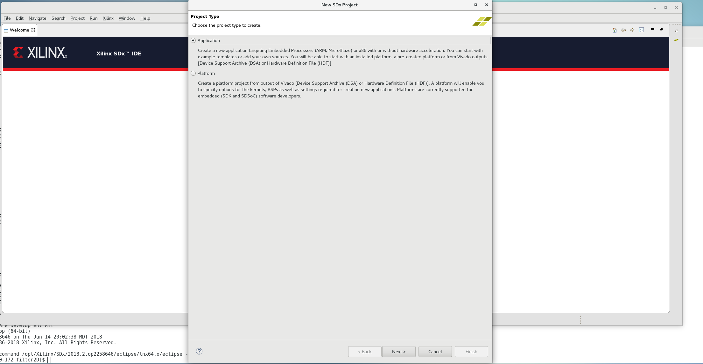
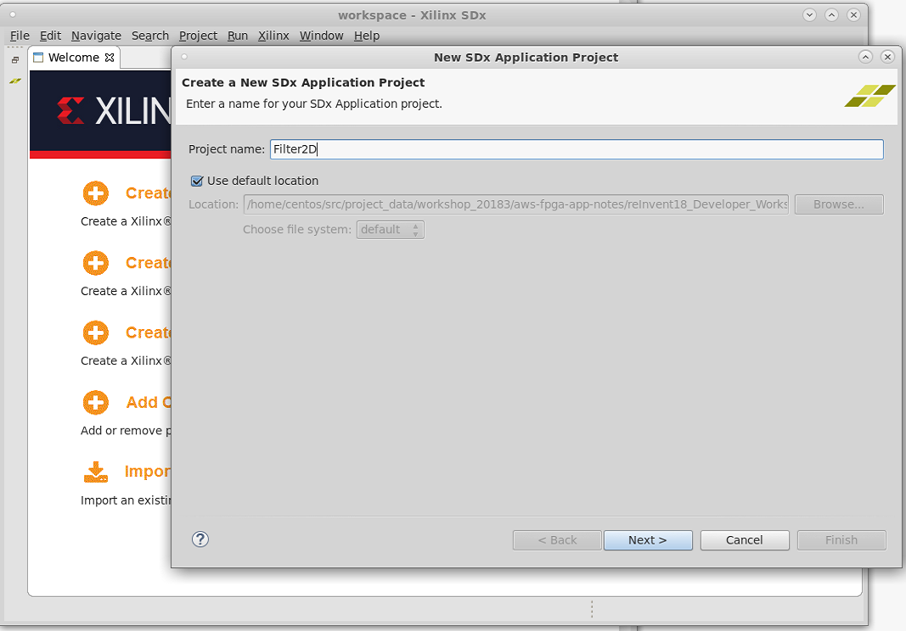
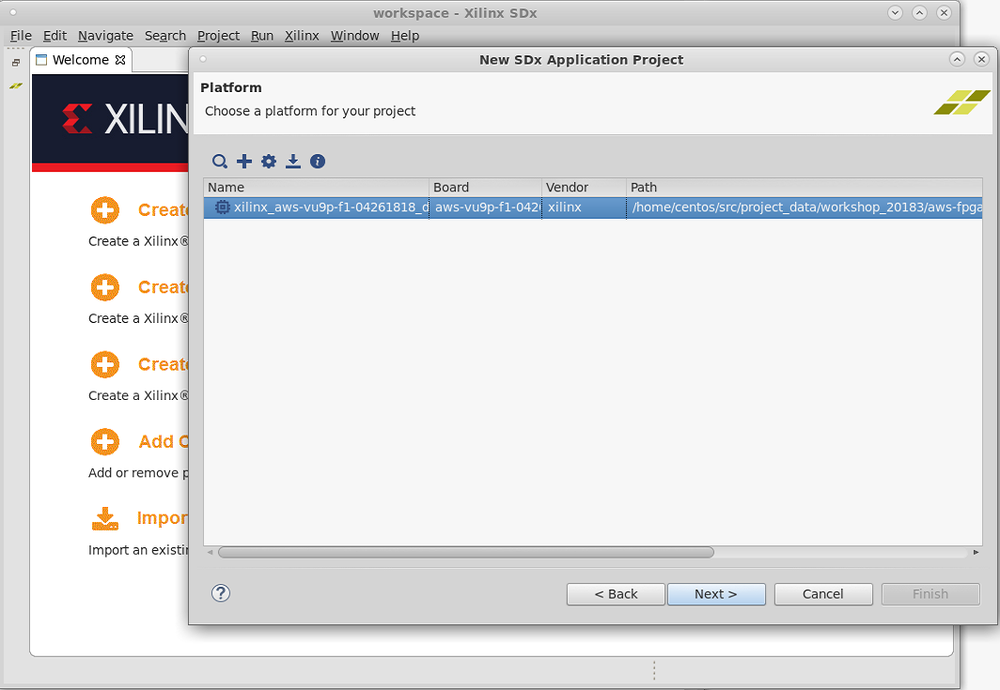
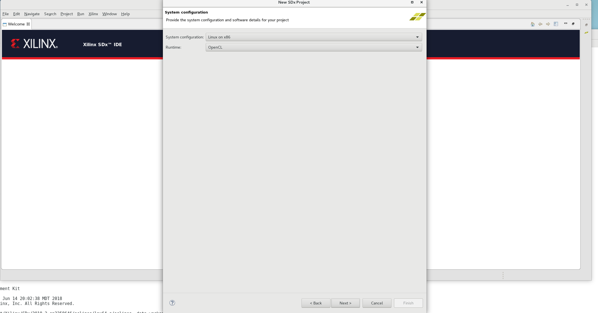
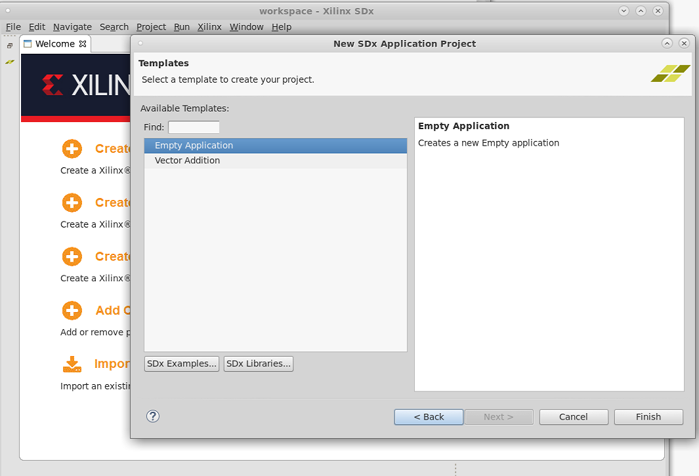
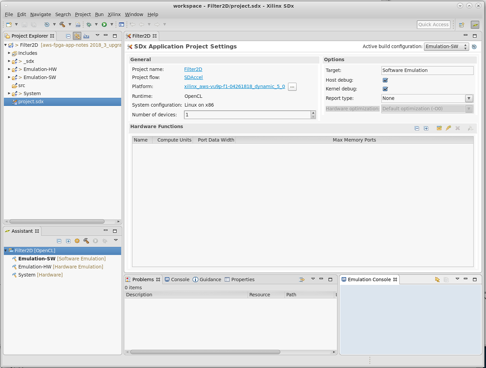
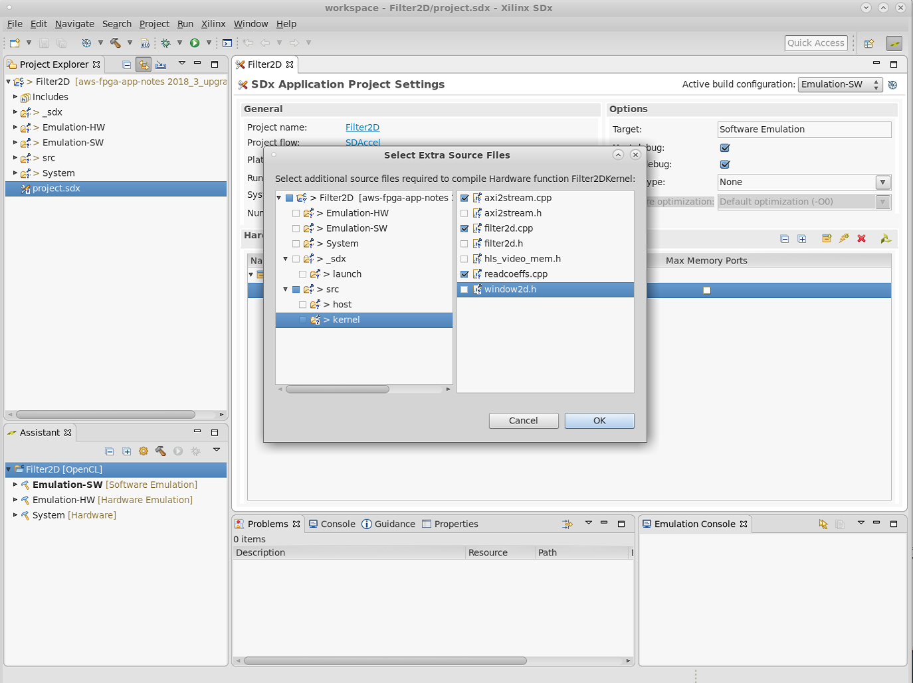
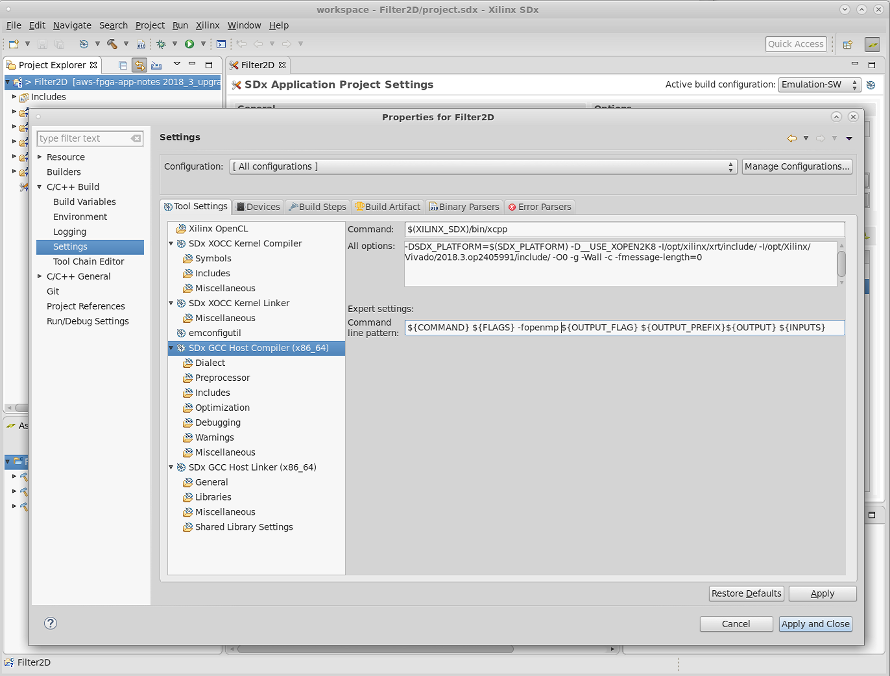
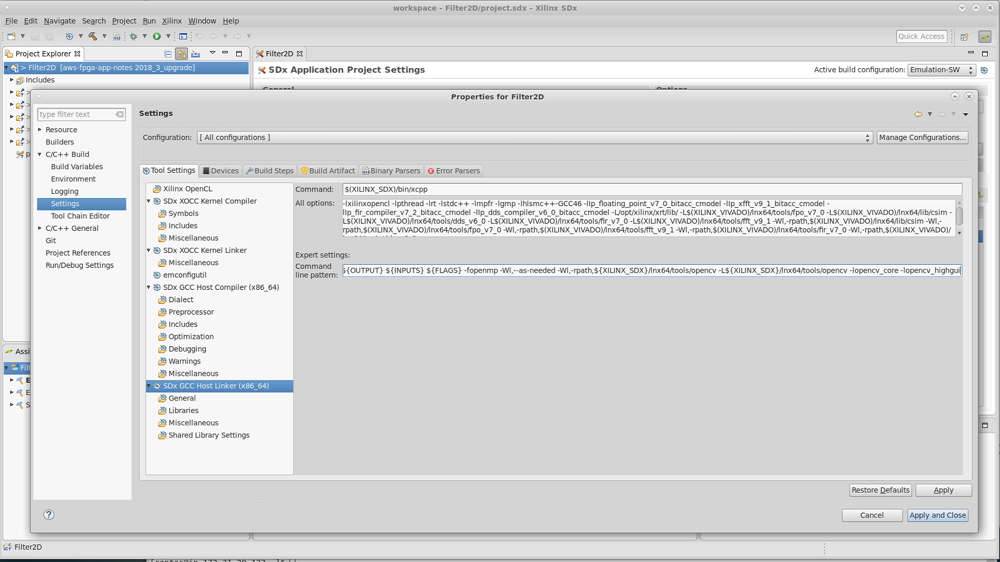
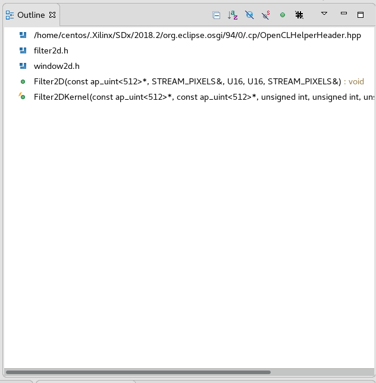

<table style="width:100%">
  <tr>
    <th width="100%" colspan="6"><h2>re:Invent 2018 Developer Workshop</h2></th>
  </tr>
  <tr>
    <td width="20%" align="center"><a href="README.md">Introduction</a></td>
    <td width="20%" align="center"><a href="SETUP.md">1. Connecting to your F1 instance</a></td> 
    <td width="20%" align="center"><a href="SDAccelGUI_INTRO.md">2. Developing an Application using SDAccel GUI</a></td>
	<td width="20%" align="center"><b>3. Developing F1 applications</b></td>
    <td width="20%" align="center"><a href="HOSTCODE_OPT.md">4. Host Code Optimization</a></td>
    <td width="20%" align="center"><a href="WRAP_UP.md">5. Wrapping-up</td>
  </tr>
</table>
	
---------------------------------------
	
### Developing, profiling and optimizing F1 applications with SDAccel

This tutorial is designed to teach the fundamentals of the SDAccel development environment and programming model. This includes: familiarizing you with OpenCL, understanding software and hardware emulation flows, profiling performance and identifying how to optimize host and kernel code. 

The kernel used in this tutorial is a 2D video filter, a function widely used in video processing algorithms such as noise reduction, and image sharpening. 

Please also note that although the entire tutorial is performed on an F1 instance, only the final step of this tutorial really needs to be run on F1. All the interactive development, profiling and optimization steps can be performed on a cost-effective AWS EC2 instance such as T3 or any other instance supported by AWS FPGA Developer AMI. Alternately, Development can also be done using on-premise systems that has Xilinx VIVADO & SDx Tools installed. However, to avoid switching instances during this tutorial, all the steps are performed on the F1 instance.

### Starting SDAccel

1. Open a new terminal by right-clicking anywhere in the Desktop area and selecting **Open Terminal**. 

1. Source the SDAccel environment   

    ```bash
    cd ~/aws-fpga
    source sdaccel_setup.sh
    cd ~
    ```
	*Note: the sdaccel_setup.sh script might generate warning messages, but these can be safely ignored.*

1. Launch the SDAccel GUI and and create a new workspace in the current directory: 
    ```bash
    cd ~/aws-fpga-app-notes/reInvent18_Developer_Workshop/filter2D
    sdx -workspace workspace
    ```
	*Note: a warning message may appear if loading Eclipse takes longer than expected. Click **Wait** to dismiss it.*

	

1. The SDAccel GUI comes up and displays the Welcome screen. Click **Create SDx Project**, then select **Application** as the new project type and click **Next**.

	

1. Name your project **Filter2D** and click **Next**.

	

1. In the **Platform** window click **Add Custom Platform...** then browse into the ```~/aws-fpga/SDAccel/aws_platform``` directory and then click **OK**.

	

1. Back in the **Platform** window choose the newly added AWS VU9P F1 custom platform and click **Next**.

1. In the **System configuration** window, keep the default settings and click **Next**.

	

1. The **Templates** window has a list of possible templates that you can use to get started in building an SDAccel project. For this tutorial, select **Empty Application** and click **Finish**.

	

1. Most of the configured information will be displayed in the **Application Project Settings** window which is prominently displayed in the center of the GUI. It indicates the project name (**Filter2D**), the selected platform (**AWS-VU9-F1**).

	

You have now successfully created a new SDAccel project called **Filter2D** for the AWS F1 platform. This is prominently displayed in the **Application Project Settings** window in the center of the GUI.


1. Familiarize yourself with the different sections of the GUI layout:
    * The **main menu** bar is located on the top. This menu bar allows direct access to all general project setup and GUI window management tasks. As most tasks are performed through the different setup windows, the main menu is mostly used to recover from accidently closed windows or to access the tool help.
    * Directly below the main menu bar is the **SDAccel toolbar**.  This provides access to the most common tasks in a project. From left to right, these are: File Management functions (new, save, save all), Configuration Management, Build, Build All, Start Debug, and Run. Most buttons have a default behavior as well as pulldowns.
    * The **Project Explorer** window occupies the top left hand side of the GUI. This window is used to manage and navigate through project files. In the expanded **src** folder you should be able to see the source files of the project. 
    * In the middle is the **Application Project Settings** window. This window is intended for project management and presents the key aspects of an SDx Project. 
    * The **Outline** viewer on the right hand side provides a high-level, or outline view, of the contents of a selected file. The content of the outline varies depending on the file currently selected in the main window.
    * In the bottom left section is the **Reports Assistant window**. This allows easy access to all reports generated by SDAccel. 
    * The remaining windows along the bottom of the main window accommodate the various consoles and terminals which contain output information relating to individual SDAccel executables. Typical output examples are compilation errors or the tool output when running.  

### Importing Design Files

1. In the **Project Explorer** window, click the **Import Sources** button
	

1. In the **Import Sources** dialog box, click **Browse** and navigate to the ```~/aws-fpga-app-notes/reInvent18_Developer_Workshop/filter2D/src``` directory. Click **OK**.

	.
	
1. Click **Select All** and then **Finish**.
        
1. You can now expand the **src** directory in the **Project Explorer** to see that all the files are now populated in the project.

### Selecting Functions for HW Acceleration

Now that you have imported all the necessary source files, you need specify which function(s) should be mapped to hardware for FPGA acceleration.

1. In the **Hardware Functions** section of the **Application Project Settings** window, click the **Add Hardware** button 
	
1. SDAccel analyzes the design for all possible kernels in the design, as well as the ability to filter the list if there are multiple kernels. Select the **Filter2DKernel** function and click **OK**. 

1. Notice that a binary container (named **binary_container_1** by default) is added to the project and the **Filter2DKernel** kernel is added to this container. 

1. The code for the kernel used in this example is distributed across different files. SDAccel must be told what those files are. In the **Hardware Functions** section of the GUI, right click on the **Filter2DKernel** and select **Select Extra Source Files...**.

1. Click on the **Filter2D > src > kernel** directory and select the three .cpp files (axi2stream.cpp, filter2d.cpp and readcoeffs.cpp) then click **OK**.

	.
	
### Defining GCC Compilation Options

The host application created in this project leverages OpenCV and OpenMP. Therefore special compilation and linking options must be provided.

1. In the **Project Explorer**, right click on the **Filter2D** project and select **Properties**

1. In the **Properties** window, select **C/C++ Build > Settings**

1. In the **Configuration** pull down, select **[All Configurations]**.

1. In the **SDx GCC Host Compiler** options, add ```-fopenmp``` to the **Expert settings:Command line Pattern** dialog and click **Apply**.

	.

1. In the **SDx GCC Host Linker** options, add ```-fopenmp -Wl,--as-needed -Wl,-rpath,${XILINX_SDX}/lnx64/tools/opencv -L${XILINX_SDX}/lnx64/tools/opencv -lopencv_core -lopencv_highgui``` to the **Expert settings:Command line Pattern** dialog and click **Apply**.

	.
     
1. Click **OK** to save and close the custom GCC options.

### Defining Run Configuration options

The host application created in this project takes in various command line arguments. In this step, you will define what flags SDAccel pass to the application when it executes it.

1. Go to the **Run**  menu dropdown and select **Run Configurations...** .

1. Select the **Arguments** tab 

1. Add ```-x ../binary_container_1.xclbin -i ../../../../img/test.bmp -n 1``` in the **Program Arguments** box and click **Apply** and then click **Close**.

	.


### Overview of source code files used in this example

   .

1. Expand the **src** directory in the **Project Explorer**. 
The project is comprised of two directories:
	* **host** contains the code for the host application running on the CPU.
	* **kernel** contains the code for the kernel (custom accelerator) running on the FPGA.

1. Expand the **host** directory in the **Project Explorer**. 
The host code is comprised of the following files:
	* **host.cpp** - main application code.
	* **filter2d.cpp**, **filter2d.h**, **coefficients.h** and **window2d.h** - code for the filter function running on the CPU.
	* **xclbin_helper.cpp** and **xclbin_helper.h** - helper code for downloading accelerators to the FPGA.
	* **cmdlineparser.cpp** and **cmdlineparser.h** - code for parsing command line arguments.
	* **logger.cpp** and **logger.h** - code for logging information.

1. Expand the **kernel** directory in the **Project Explorer**. 
The kernel code is comprised of the following files:
	* **filter2d.cpp** and **filter2d.h** - code for the filter function running on the FPGA.
	* **axi2stream.cpp** and **axi2stream.h** - code for efficiently reading from and writing to memory.
	* **window_2d.h** and **hls_video_mem.h** - code for handling video line buffers and pixel windows.

### Overview of the kernel code

1. Now double-click on the **filter2d.cpp** file in the **src/kernel** folder to open it.

1. Locate the **Outline** viewer located on the right side of the GUI. 
	* This view provides a convenient way of looking-up and navigating the code hierarchy. 
	* Each green dot in the **Outline** viewer corresponds to a function in the selected source file. 

	

1. In the **Outline** viewer, click **Filter2DKernel** to look-up this function. 
	* The **Filter2DKernel** function is the top-level of the filter kernel implemented in the custom hardware accelerator. Interface properties for the accelerator are specified in this function. This computationally heavy function can be highly parallelized on the FPGA, providing significant acceleration over a CPU-based implementation.
	* The kernel encapsulates the three main functions of the accelerator: **AXIBursts2PixelStream**, **Filter2D**, and **PixelStream2AXIBursts**.
		* The **AXIBursts2PixelStream** function reads from global memory values sent by the host application and streams them to the **Filter2D** function.
		* The **Filter2D** function receives the pixel data and performs the actual filter computations, and streams the results to the next function
		* The **PixelStream2AXIBursts** function receives the streaming results from the **Filter2D** function and writes them back to global memory for the host application.
	* Observe that the three functions are communicating using `hls::stream` objects. These objects model a FIFO-based communication scheme. This is the recommended coding style which should be used whenever possible to provide streaming behavior and allow DATAFLOW optimization.
		- The DATAFLOW optimization allows each of the subsequent functions to execute as independent processes. 
		- This results in overlapping and pipelined execution of the read, execute and write functions instead of sequential execution.
		- The FIFO channels between the different processes do not need to buffer the complete dataset anymore but can directly stream the data to the next block. 
	* Note that the **Filter2D** kernel processes only a single color plane. At compile time, we can choose to have 1 or many kernels in the FPGA. 
		- When there is only 1 kernel in the FPGA, a planar formatted YUV 4:4:4 image will have its luma and chroma planes procesed sequentially. 
		- When there are 3 kernels in the FPGA, the luma and both chroma planes can be processed in parallel, therefore having a higher performance, at the cost of more FPGA resources. We will get back to this later in the lab.

1. Using the **Outline** viewer, quickly look-up and inspect the other important functions of the accelerator:
	* The **Filter2D** function is the heart of the custom hardware accelerator that peforms the filter computations.
	* It uses the **Window2D** class that provides an abstraction for getting a two-dimensional pixel window, then performs a simple convolution of the pixels in this window with a programmable filter.
	* Note the ```#pragma HLS PIPELINE II=1``` statement on line 26. This pragma tells the compiler that a new iteration of the for loop should be started exactly one clock cycle after the previous one.  As a result, the SDAccel compiler builds an accelerator with 15*15=225 multipliers. Where the 225 multiply-add operations of the 2D convolution would be executed sequentially on a conventional CPU architecture, they are executed in parallel in the purpose-built FPGA accelerator. This results in a significant performance improvement.  
	
### Overview of the host application code
	
1. Open file **host.cpp** from the **src/host** folder of the **Project Explorer** view.  
	* This C++ program initializes the test vectors, sets-up OpenCL, runs the reference model, runs the hardware accelerator, releases the OpenCL resources, and compares the results of the reference Filter2D model with the accelerator implementation.
	
1. Go to line 215 of the **host.cpp** file by pressing **Ctrl+L** and entering **215**. The **load_xclbin_file** function is where the OpenCL environment is setup in the host application. 

1. Using the right mouse button, click on the **load_xclbin_file** function and chose **Open Declaration** to jump to the declaration of the function located in the **xclbin_helper.cpp** file.
	* This function takes care of retrieving the OpenCL platform, device ID, creating the OpenCL context and create the OpenCL program. These four steps are typical of all SDAccel application.
	* The functions implementing these four steps (also located in the **xclbin_helper.cpp** file) will look very familiar to developers with prior OpenCL experience. This code can often be reused as-is from project to project. 
	* Of particular note is the call to **clCreateProgramWithBinary** (line 87). This function loads contents of the specified FPGA binary file (.xclbin or .awsxclbin file) into the FPGA device of the AWS EC2 F1 instance. 
	* All objects accessed through a **clCreate...** function call are to be released before terminating the program by calling **clRelease...**. This avoids memory leakage and clears the lock on the device.

1. Now go back to the **host.cpp** file and go to line 309. This where the image is processed using a conventional software implementation.
	* Line 322-324, the **Filter2D** function is called 3 times to process the Y, U and V color planes of the image, respectively.
	* Line 318, the OpenMP ```#pragma omp parallel for``` pragma is used to multi-thread the calls to the **Filter2D** function. This ensures a fair benchmark comparison betweem the CPU and FPGA executions.

1. Scroll upwards to line 263. This is where the image is processed using the FPGA accelerator.
	* Notice how this code looks very similar to the software implementation you just inspected. 
	* Line 279-281, the **Filter()** operator is used to issue independent requests to process the Y, U and V color planes using the FPGA accelerator.
	* **Filter** is declared line 269 as an object of type **Filter2DDispatcher**. The **Filter2DDispatcher** class encapsulates the necessary OpenCL API calls used to send requests to the hardware accelerated Filter2DKernel.

1. Click on **Filter2DDispatcher** and press **F3** to go to the declaration of the class.

	The class constructor (line 85) creates the OpenCL objects required to communicate with the FPGA accelerator: 
	* **clCreateKernel** is used to create the kernel object.
	* **clCreateCommandQueue** is used to create the command-queue used to send commands to the FPGA device.  

	The overloaded ```()``` operator (line 96) is used to form and send requests to the accelerator.
	* **clCreateBuffer** calls are used to create the input and output memory buffers.
	* **clEnqueueMigrateMemObjects** calls are used to schedule the transfer of the input buffers to the FPGA device and then transfer the output buffer back to the host.
	* **clSetKernelArg** calls are used to set the arguments of the kernel.
	* **clEnqueueTask** is used to schedule the execution of the kernel.
	* **clSetEventCallback** is used to register a user callback function, which in this case, simply prints a message when transfer of the output buffer back to the host is complete.

	All of the above API functions are documented by the [Khronos Group](https://www.khronos.org), the maintainers of OpenCL, the open standard for parallel programming of heterogeneous systems


### Running the Emulation Flows

SDAccel provides two emulation flows which allow testing the application before deploying on the F1 instance. The flows are referred to as **software emulation** (or Emulation-CPU) and **hardware emulation** (or Emulation-HW), respectively.
* Software emulation is used to identify syntax issues and verify the functional behavior of the application.
	* In software emulation, both the host code and the kernel code are compiled to run on the x86 processor. 
	* This allows iterative algorithm refinement through fast build and run loops.
* Hardware emulation is used to get performance estimates for the accelerated application.
	* In hardware emulation, the host code is compiled to run on the x86 processor and the kernel code is compiled into a hardware model (known as RTL or Register Transfer Level) which is run in a special simulator.
	* The build and run cycle takes longer because the kernel code is compiled into a detailed hardware model which is slower to simulate.
	* The more detailed hardware simulation allows more accurate reporting of kernel and system performance.
	* This flow is also useful for testing the functionality of the logic that will go in the FPGA.

In this lab, we will only run the hardware emulation flow.

1. Return to the **SDx Project Settings** window by clicking on **Filter2D** tab in the central window of the SDx the GUI.

1. In the upper right corner of the **SDx Project Settings** window, the **Active build configuration** is shown. Ensure that **Emulation-HW** is selected.

1. Uncheck the **Host debug** check box located in the right side of the **SDx Project Settings** window. 

1. Click the **Run** button  to run hardware emulation.
	* Compiling the entire project takes about ~10 to 15 minutes.
	* The **Console** provides the detailed build log during the compilation of the kernel and the host code. 
	* It then displays the standard output produced by the application during the actual emulation run.  
	* The hardware emulation is complete when the following messages are displayed at the bottom of the **Console**:	

	```
	Xilinx 2D Filter Example Application

	FPGA binary    : ../binary_container_1.xclbin
	Input image    : ../../../../img/test.bmp
	Number of runs : 1
	Filter type    : 0

	Programming FPGA
	INFO: [SDx-EM 01] Hardware emulation runs detailed simulation underneath. It may take long time for large data set. Please use a small dataset for faster execution. You can still get performance trend for your kernel with smaller dataset.

	Running FPGA version
	   kernel finished processing request 0
	   kernel finished processing request 1
	   kernel finished processing request 2

	Running Software version

	*******************************************************
	MATCH PASS: Output matches reference
	*******************************************************
	INFO: [SDx-EM 22] [Wall clock time: 01:14, Emulation time: 0.473166 ms] Data transfer between kernel(s) and global memory(s)
	BANK0          RD = 69.094 KB              WR = 48.000 KB       
	BANK1          RD = 0.000 KB               WR = 0.000 KB        
	BANK2          RD = 0.000 KB               WR = 0.000 KB        
	BANK3          RD = 0.000 KB               WR = 0.000 KB 	    
	```

### Analyzing the Reports  

This section covers how to locate and read the various reports generated by the emulation runs. 

1. Locate the Reports **Assistant** window in the bottom-left corner of the GUI. 
	* This window displays a tree layout of folders and reports for all runs and open projects. 
	* The top level shows the **Filter2D** project for which we have executed the **Emulation-HW** run.
	* The **Filter2D-Default** run configuration folder contains the **Profile Summary** and **Application Timeline** report generated during the hardware emulation run.

	

1. Open the **Profile Summary** report by double-clicking on the item in the **Reports** window. 

	* This report provides data related to how the application runs. 
	* Notice that the report has four tabs at the top: **Top Operations**, **Kernels & Compute Units**, **Data Transfers**, and **OpenCL APIs**. 
    
1. Click through and inspect each of the tabs:

    * **Top Operations**: Shows all the major top operations of memory transfer between the host and kernel to global memory, and kernel execution. This allows you to identify throughput bottlenecks when transferring data. Efficient transfer of data to the kernel/host allows for faster execution times.
    
    * **Kernels & Compute Units**: Shows the number of times the kernel was executed. Includes the total, minimum, average, and maximum run times. If the design has multiple compute units, it will show each compute unit’s utilization. When accelerating an algorithm, the faster the kernel executes, the higher the throughput which can be achieved. It is best to optimize the kernel to be as fast as it can be with the data it requires.
    
    * **Data Transfers**: Shows the throughput and bandwidth of the read/writes to the global memory that the host and kernel share.
    
    * **OpenCL APIs**: Shows all the OpenCL API command executions, how many time each was executed, and how long they take to execute.

1. Locate the **Profile Rule Checks** section at the bottom of the **Profile Summary** 
	* **Profile Rule Checks** (PRCs) interpret profiling results and suggest areas for performance improvements.
	* PRCs compare profiling results to threshold values. If a check does not meet the threshold value, the right hand column provides guidance on how to improve performance.
	* PRCs work for both hardware emulation and system runs on the FPGA.

	 

1. Open the **Application Timeline** report from the **Emulation-HW** run. 
	* The **Application Timeline** collects and displays host and device events on a common timeline to help you understand and visualize the overall health and performance of your systems. 
	* These events include OpenCL API calls from the host code: when they happen and how long each of them takes.

	

	- Observe at the bottom of the timeline view that we have one instance of **Filter2DKernel**
	- The green segments indicate that the kernel is executed consecutively 3 times and is continuously running
	- The blue and brown segments located immediately above represent when the kernel is reading input and writing results to and from global memory
	- We can see that the longer blue segments align with the start of each of the 3 invocations of the kernel

1. Close the **Application Timeline** and **Profile Summary** report.

### Optimization   

The first hardware run helped establish a performance baseline. The next step is to optimize the application to improve overall performance. This tutorial illustrates two optimization techniques:
 1) improving throughput by executing multiple kernels in parallel
 2) improving latency by optimally scheduling execution of kernels within the host application.


#### Adding More Kernels  

As we saw earlier, lines 279, 280 and 281 of **host.cpp** is where the host application issues requests to the FPGA accelerator. The three requests are indepedent of each other and could be therefore be executed in parallel. But since there is a single kernel in the FPGA device, the three requests need to be processed sequentially on that single kernel.

This is exactly what we observed earlier in the **Application Timeline**: one kernel executing three requests back-to-back . 

The kernel is the main bottleneck in our application. By putting more kernels in the FPGA we will be able to process more requests in parallel and improve performance.

1. Return to the **SDx Project Settings** by clicking on the **Filter2D** tab.

1. Locate the **Hardware Functions** section in the bottom half of the window

1. Increase the number of **Compute Units** for the **Filter2DKernel** from 1 to 3

	

1. Make sure **Emulation-HW** is still selected as the **Active build configuration** and run HW emulation by clicking the **Run** button  or by pressing **Ctrl+F11**
	- SDAccel must now rebuild the FPGA program to take in account this modification
	- Rebuilding for hardware emulation takes about 5 minutes

1. After HW emulation completes, open the newly generated **Application Timeline**. 

		

	_Note: CPU load may impact how OpenCL APIs scheduled, influencing the emulation results and the timeline you will observe._

	- Observe that we now have 3 kernels instances executing in parallel
	- Instead of processing Y, U and V planes sequentially, the application is now processing them at the same time
	- The short offset between the start of each kernel run is due to the sequential transfer of input data from the host to the FPGA

1. Close the **Application Timeline**.

By using more kernel instances, we took advantage of task-level parallelism to improve the performance of the application

Notice that we didn't have to modify the host application to take advantage of the extra kernels instances. The application simply submits requests to the OpenCL command queue. These requests are handled by the Xilinx OpenCL runtime. The runtime sees that there are 3 kernel instances in the FPGA and is able to execute the requests on the first available instance.  


#### Processing More Images

In the previous run, the application processed a single image. In a real life scenario, the application would most likely need to process multiple images or video frames. It is therefore important to profile the performance of the application when processing multiple images. 

As can be seen line 177 of **host.cpp**, the application already supports a command line argument to specify the number of times the input image should be processed. We will use this argument to easily generate a new timeline trace, this time making two processing passes on the input image.

1. From the **main menu** bar of the SDx GUI, choose the **Run** menu and open the **Run Configurations** window.

1. In the **Run Configurations** window, choose the **Arguments** tab.
	- This tab allows specifying the command line arguments passed to the application when it is executed
		- ```-x``` is used to specify the name of FPGA image
		- ```-i``` is used to specify the name of bitmap image to be processed
		- ```-n``` is used to specify how many times the image should be processed

1. Change ```-n 1``` to ```-n 2```. 
	- This will cause the application to process the image twice instead of just once

		

1. Click **Apply** and then **Close**.

1. Rerun HW emulation by clicking the **Run** button or by pressing **Ctrl+F11**.
	- This time, the application doesn't need to be recompiled since only command line arguments were changed
	- The HW emulation run should complete in under a minute
	- Notice that in the console, 6 requests are now reported instead of the 3 we saw before

1. Open the newly generated **Application Timeline**. 

	

	_Note: CPU load may impact how OpenCL APIs scheduled, influencing the emulation results and the timeline you will observe._

    - Observe that there are now 6 total invocations of **Filter2DKernel**, as expected
    - Since there are 3 instances of the kernel, each kernel instance is put to work twice
    - Observe also that there is a gap between two executions of a given kernel instance
    - Effectively, the second execution of Filter2DKernel_1 only starts after the end of the first execution of the Filter2DKernel_3
	- The gap between the two segments is indicative of idle time between these two invocations 

We can improve the latency of our application by removing the idle time between consecutive kernel invocations.

	
#### Host Code Optimization

1. Go to line 274 of **host.cpp**.

	```C
	for(int xx=0; xx<numRuns; xx++) 
	{
		// Make independent requests to Blur Y, U and V planes
		// Requests will run sequentially if there is a single kernel
		// Requests will run in parallel is there are two or more kernels
		request[xx*3+0] = Filter(coeff.data(), y_src.data(), width, height, stride, y_dst.data());
		request[xx*3+1] = Filter(coeff.data(), u_src.data(), width, height, stride, u_dst.data());
		request[xx*3+2] = Filter(coeff.data(), v_src.data(), width, height, stride, v_dst.data());

		// Wait for completion of the outstanding requests
		request[xx*3+0]->sync();
		request[xx*3+1]->sync();
		request[xx*3+2]->sync();
	}
	```

	This is the section of the code where the application issues requests to the kernels.
	- Notice how after issuing the three requests, the application synchronizes by waiting for the completion of the outstanding requests
	- The second iteration of the ```for xx``` loop will only start after the completion of the previous three request
	- This corresponds to what we observed in the **Application Timeline**

	To remove the gap between two kernel invocation, we need to change the sequence of requests and synchronizations. 

1. Modify the source code as shown below
	```C
	for(int xx=0; xx<numRuns; xx++) 
	{
		// Make independent requests to Blur Y, U and V planes
		// Requests will run sequentially if there is a single kernel
		// Requests will run in parallel is there are two or more kernels
		request[xx*3+0] = Filter(coeff.data(), y_src.data(), width, height, stride, y_dst.data());
		request[xx*3+1] = Filter(coeff.data(), u_src.data(), width, height, stride, u_dst.data());
		request[xx*3+2] = Filter(coeff.data(), v_src.data(), width, height, stride, v_dst.data());
	}
	for(int xx=0; xx<numRuns; xx++) 
	{
		// Wait for completion of the outstanding requests
		request[xx*3+0]->sync();
		request[xx*3+1]->sync();
		request[xx*3+2]->sync();
	}
	```

	With this change, the application first issues all the necessary requests and then waits until all the tasks have completed.

1. Save the file (**Ctrl-S**) and rerun hardware emulation by clicking the **Run** button . 

    - Since only the **host.cpp** file was changed, the incremental makefile rebuilds only the host code before running emulation.
    
	
1. Open the **Application Timeline** of the **Emulation-HW** run.  

	

    - The big gaps between two consecutive kernel invocations has been eliminated
    - The previous sequence was: send 3 requests, wait for their completion, send 3 new requests, wait for their completion
    - The new sequence is: send 6 requests, wait for their completion
    - The result is less idle time and reduced latency

By paying careful attention to how the code submits requests and waits for their completion, we can noticeably improve the performance of the application.

### Building the FPGA binary to execute on F1 

Once the application and kernel code have been optimized, the next step is to create an FPGA binary for execution on the F1 instance. 

On AWS, creating the FPGA binary is a two-step process:
* First SDAccel is used to build the Xilinx FPGA binary (.xclbin file).
* Then the AWS **create_sdaccel_afi.sh** script is used to create the AWS FPGA binary (.awsxclbin file) and register a secured and encrypted Amazon FPGA Image (AFI).

The **create_sdaccel_afi.sh** script does the following:
* Starts a background process to create the AFI
* Generates a \<timestamp\>_afi_id.txt which contains the FPGA Image Identifier (or AFI ID) and Global FPGA Image Identifier (or AGFI ID) of the generated AFI
* Creates the *.awsxclbin AWS FPGA binary file which is read by the host application to determine which AFI should be loaded in the FPGA.

These steps would take too long (~6 to 8 hours for all kernels) to complete during this tutorial, therefore precompiled FPGA binaries are used to continue this lab and execute on F1.

### Executing on F1 

1. Quit the SDAccel GUI and return to the terminal from which you started the tool.

1. Make sure you are in the correct directory
	```bash
	cd ~/aws-fpga-app-notes/reInvent18_Developer_Workshop/filter2D
	```

1. List the content of the xclbin directory:
	```bash
	ls -la ./xclbin
	```

	- Notice that there are three .awsxclbin files ready to use
	- These .awsxclbin files correspond to FPGA binaries with 1, 3 and 6 kernel instances, respectively 

1. Copy the host application executable built in the SDAccel workspace to the local directory.
	```bash
    cp ~/aws-fpga-app-notes/reInvent18_Developer_Workshop/filter2D/workspace/Filter2D/Emulation-HW/Filter2D.exe .
	```
	
1. Setup the SDAccel runtime environment and F1 drivers.
    ```sh
    sudo sh
    source /opt/xilinx/xrt/setup.sh
    ```

1. Execute on F1 using the FPGA binary with 1 kernel instance.    
	```sh
	./Filter2D.exe -i img/picadilly_1080p.bmp -n 10 -x ./xclbin/fpga1k.hw.xilinx_aws-vu9p-f1-04261818_dynamic_5_0.awsxclbin
	```

	- The application loads a 1080p image (```-i``` argument)
	- It processes this image 10 times (```-n``` argument)
	- It uses a FPGA binary with 1 kernel (```-x``` argument)

1. Note the performance difference between the FPGA-accelerated and CPU-only executions of the 2D image filtering function. With a single kernel, the accelerated version is more than 19x faster than the multi-threaded CPU version.

1. Now perform the same run using the FPGA binary with 3 kernel instances.
	```sh 
	./Filter2D.exe -i img/picadilly_1080p.bmp -n 10 -x ./xclbin/fpga3k.hw.xilinx_aws-vu9p-f1-04261818_dynamic_5_0.awsxclbin
	```
1. Compare the new performance numbers: the version with 3 kernels is nearly 3x faster than the version with a single kernel.

1. Now perform the same run using the FPGA binary with 6 kernel instances.
	```sh 
	./Filter2D.exe -i img/picadilly_1080p.bmp -n 10 -x ./xclbin/fpga6k.hw.xilinx_aws-vu9p-f1-04261818_dynamic_5_0.awsxclbin
	```

1. This version is more than 130x faster than the multi-threaded CPU version (!).

	Additional kernels can easily be added (either more 2D filter kernels or different types of kernels) until all FPGA resources are utilized or until the global memory bandwidth is saturated.
	
1. Close your terminal to conclude this module.

	```sh
	exit
	exit
	```	
	
### Summary  

In this lab, you learned:
* Key features of the SDAccel development environment
* Important OpenCL API calls to communicate between the host and the FPGA
* How to use the hardware emulation flow to generate performance estimates prior to running on F1
* How to read the various reports generated by SDAccel
* How to improve performance by adding more kernels to take advantage of task-level parallelism
* How to improve performance by managing synchronization points in the host application.

---------------------------------------

<p align="center"><b>
Start the next module: <a href="HOSTCODE_OPT.md">NEXT: 4. Host Code Optimization</a>
</b></p>
