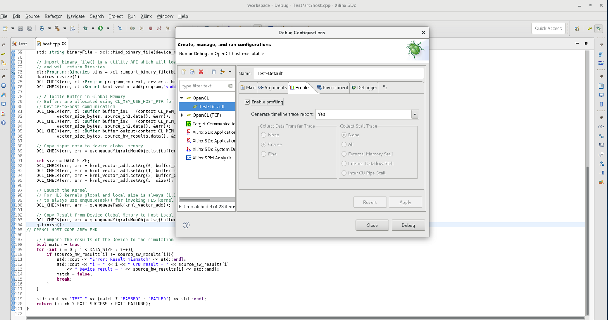
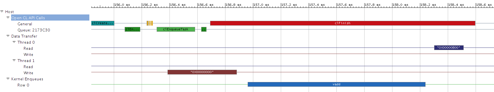
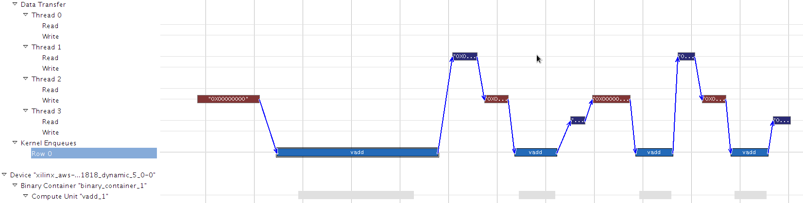

<table style="width:100%">
  <tr>
    <th width="100%" colspan="6"><h2>re:Invent 2018 Developer Workshop</h2></th>
  </tr>
  <tr>
    <td width="20%" align="center"><a href="README.md">Introduction</a></td>
    <td width="20%" align="center"><a href="SETUP.md">1. Connecting to your F1 instance</a></td>
    <td width="20%" align="center"><b>2. Developing an Application using SDAccel GUI</b></td>
	<td width="20%" align="center"><a href="FILTER2D_Lab.md">3. Developing F1 applications</a></td>
    <td width="20%" align="center"><a href="HOSTCODE_OPT.md">4. Host Code Optimization</a></td>
    <td width="20%" align="center"><a href="WRAP_UP.md">5. Wrapping-up</td>
  </tr>
</table>

---------------------------------------
### Introduction to the SDAccel Development Environment

This lab uses an example from the Xilinx® SDAccel™ Example GitHub repository, which can be found [here](https://github.com/Xilinx/SDAccel_Examples). 

#### Preparing to Run the Tutorial
* Using a RDP client, connect to an AWS EC2 instance loaded with the FPGA Developer AMI. Instructions on how to accomplish this are covered in the [Create, configure and test an AWS F1 instance](SETUP.md) guide.

* In a terminal on your AWS instance, execute the following commands to configure the SDAccel environment:   
    ```bash
    cd ~/aws-fpga
    source sdaccel_setup.sh
    ```
#### Creating an SDAccel Project
In this step, you will launch SDAccel, create a new workspace, load the custom AWS F1 platform file and create a new project.

*  Change to "helloworld_c" directory and Launch the SDx GUI with the command below. 
    ```bash
    cd ~/aws-fpga-app-notes/reInvent18_Developer_Workshop/helloworld_c
    sdx -workspace ./workspace
    ```
    > Note that the first invocation of the SDx GUI on a given AWS instance will not be instantaneous but subsequent invocations will be much faster.

* You will be greeted with welcome screen. In the welcome screen click on **Create SDx project**

* In the **Project Type** window, select **Application** and click **Next**.

* In the **Create a New SDx project** window in the **Project name** field, type **Test** and click **Next**.

* In the **Platform** window click **Add Custom Platform...** then browse into the ```~/aws-fpga/SDAccel/aws_platform``` directory and then click **OK**.

* Back in the **Platform** window choose the newly added AWS VU9P F1 custom platform and click **Next**.

* In the **System configuration** window, the only option for **System configuration** is **Linux on x86** and the only option for **Runtime** is **OpenCL**. Click **Next**.

* The **Templates** window has a list of possible templates that you can use to get started in building an SDAccel project. For this tutorial, select **Empty Application** and click **Finish**.

You have now successfully created a new SDAccel project called **Test** for the AWS F1 platform. This is prominently displayed in the SDx **Application Project Settings** window in the center of the GUI.

The default GUI perspective includes the following sections:

   * The **main menu** bar is located on the top. This menu bar allows direct access to all general project setup and GUI window management tasks. As most tasks are performed through the different setup windows, the main menu is mostly used to recover from accidentally closed windows or to access the tool help.
   * Directly below the main menu bar is the **SDAccel toolbar**. This provides access to the most common tasks in a project. 
   * The **Project Explorer** window occupies the top left hand side of the GUI. This window is used to manage and navigate through project files.
   * In the middle is the **Application Project Settings** window. This window is intended for project management and presents the key aspects of an SDx Project.
   * The **Outline** window on the right hand side is used for file navigation. The content of the outline varies depending on the file currently selected in the main window.
   * In the bottom left section is the **Assistant** window. This allows easy access to all reports generated by SDAccel.
   * The remaining windows along the bottom of the main window accommodate the various consoles and terminals which contain output information relating to individual SDAccel executables. Typical output examples are compilation errors or the tool output when running.

 Refer to the **SDAccel Environment User Guide** ([UG1023](https://www.xilinx.com/support/documentation/sw_manuals/xilinx2018_2/ug1023-sdaccel-user-guide.pdf)) for more information on the features of the SDx IDE.

#### Importing Design Files

* In the **Project Explorer** window, right click on the **src** folder and select **Import Sources**.

* In the **Import Sources** dialog box, click **Browse** and navigate to the ```~/aws-fpga-app-notes/reInvent18_Developer_Workshop/helloworld_c/src``` directory. Click **OK**.

* Click **Select All** and click **Finish**.

* You can now expand the **src** directory in the **Project Explorer** to see that all the files are now populated in the project.
    * **host.cpp** - source code for the host program
    * **vadd.cpp** - source code for the C++ kernel implementing a vector-add function
    * **xcl2.cpp** and xcl2.hpp - helper functions facilitating the use of FPGA binary files

* Double-click on **host.cpp** to open it. This simple example is compact and contains many comments to help understand how the code operates and how the host application interacts with the kernel in the FPGA device.


#### Selecting Functions for HW Acceleration

Now that you have imported all the necessary source files, you need specify which function(s) should be mapped to hardware for FPGA acceleration.

* In the **Hardware Functions** section of the **Application Project Settings** window, click the **Add Hardware** button .

* SDAccel analyzes the design for all possible kernels in the design, as well as the ability to filter the list if there are multiple kernels. For this design, only the **vadd** qualified function exists.

* Select the **vadd** function and click **OK**. 

* Notice that a binary container (named **binary_container_1** by default) is added to the project and the **vadd** kernel is added to this container. 


#### Running Software Emulation

Software Emulation is used for checking the functional correctness when the host and kernel code are running together. The kernel is compiled as a software function which makes for very quick compilations times and quick iteration loops. Software Emulation well suited for algorithm refinement, functional debugging and rapid code improvements.

* Go to **Application Project Settings**, and ensure that the **Active build configuration** is set to **Emulation-SW**.

* Go to drop down menu beside  **Debug** button  and select **debug configuration**. Then select **Profile** tab and set **Generate timeline trace report** option to **Yes**. Click the **Apply** button and then Click **Close** button to close the debug configurations window.

   
   
* In the **SDAccel toolbar**, click the **Build** button . This builds the project for Software Emulation and takes a short minute to complete. 

* After the design is built, click the **Run** button . This runs Software Emulation. The host application executes and interacts with the C version of the kernel. You will see messages being displayed in the **Console** window. The run ends with a message saying the test has passed:
    ```
    Found Platform
    Platform Name: Xilinx
    XCLBIN File Name: vadd
    INFO: Importing ../binary_container_1.xclbin
    Loading: '../binary_container_1.xclbin'
    TEST PASSED
    ```

#### Using the Debugger

SDAccel features a built-in debugger which you can use to step through the application to pinpoint issues. Here you will learn how to start and use the debugger and you will single-step through the code to better understand how the host application interacts with the kernel in the FPGA device.

* Open the **host.cpp** file by clicking under **src/host.cpp** in the **Project Explorer** window .

* Set a breakpoint on line 73 by right-clicking on the line number and selecting **Toggle Breakpoint**. 

* To run in **Debug** mode, click on the **Debug** button . A dialog box opens up asking you to switch to that perspective. Click **Yes**.

* Using the Eclipse debug perspective, the host and kernel code can be examined in more detail. All the controls with which to do step-by-step debugging are in the **main menu** bar or in the **Run** menu.

* After you start, the program stops at the first line of the **main** function.

* Click on the **Resume** button (F8)  to advance to the next breakpoint.

* The debugger now reaches your breakpoint at line 73 of the **host.cpp** file. 

* Use the **Step Over** button (F6)  to step through the code and study the API call sequence in the host application. Notice in particular:
    * Line 73: the application loads the FPGA binary file in the device.
    * Lines 81-83: the application creates the buffers to exchange data with the device. The **vadd** takes two input arrays and generates one output array. Therefore 3 buffers are created: one for each array.
    * Line 89: the application schedules the migration the two input buffers to the device.
    * Line 92-95: the application sets the input arguments of the kernel.
    * Line 100: the application schedules the execution of the kernel.
    * Line 103: the application schedules the migration of the output buffer back to the host.
    * Line 104: the application waits to all scheduled operations to complete.

    > Note: This simple sequence is representative of how communications between host and device are typically managed in an SDAccel application.

* Close the **Debug Perspective** by going to the upper-right of the window where it shows the  button, right-click on it and select **Close**.


#### Using the Application Timeline

* In the **Assistant** window, expand **Test[OpenCL]** **Emulation-SW** and then **Test-Default**. Double-click **Application Timeline** to open it. This shows a timeline of the OpenCL API calls, data transfers and kernel executions.

* Zoom-in in the far right section of the timeline. Here you will find the sequence where the host application transfers data to the device, programs the kernel, executes it and migrates the results back. It should look similar to the image below:



* Notice how the timeline provides a visual representation of the API call sequence that you just stepped through during the debug step. Let's do a simple experiment to confirm this.

* Close the **Application Timeline** window.

* Return to the **host.cpp** file and add a loop with 4 iterations around lines 88 and 103 (included). The modified code should like this:

    ```c
    for (int i=0; i<4; i++) {
      // Copy input data to device global memory
      OCL_CHECK(err, err = q.enqueueMigrateMemObjects({buffer_in1, buffer_in2},0/* 0 means from host*/));

      int size = DATA_SIZE;
      OCL_CHECK(err, err = krnl_vector_add.setArg(0, buffer_in1));
      OCL_CHECK(err, err = krnl_vector_add.setArg(1, buffer_in2));
      OCL_CHECK(err, err = krnl_vector_add.setArg(2, buffer_output));
      OCL_CHECK(err, err = krnl_vector_add.setArg(3, size));

      // Launch the Kernel
      // For HLS kernels global and local size is always (1,1,1). So, it is recommended
      // to always use enqueueTask() for invoking HLS kernel
      OCL_CHECK(err, err = q.enqueueTask(krnl_vector_add));

      // Copy Result from Device Global Memory to Host Local Memory
      OCL_CHECK(err, err = q.enqueueMigrateMemObjects({buffer_output},CL_MIGRATE_MEM_OBJECT_HOST));
    }
    q.finish();
    ```

* Save the changes and click the **Run** button . Since the kernel code wasn't modified, the incremental build flow only recompiles the host program before running Software Emulation.

* Wait for the **TEST PASSED** message to appear in the **Console** and reopen the **Application Timeline**. 

* Zoom to the far right to study the effect of your code change on the execution sequence of your application.

* Click one of the blue **vadd** boxes in the **Kernel Enqueues** section of the timeline. Notice how the read/execute/write dependencies are highlights and how you now have 4 consecutive invocations of the **vadd** kernel



#### Running Hardware Emulation

Software Emulation runs using a abstract model of the kernel. It is very convenient to make rapid iterations and verify the functional correctness of the application, but it is not detailed enough to provide meaningful performance estimates. For this purpose, SDAccel provide the Hardware Emulation mode. Hardware Emulation compiles the kernel into a hardware representation that is much closer to what is seen on the FPGA device. This means that data related to bandwidth, throughput, and execution time are more accurate. This also causes the design to take longer to compile and run. 

You will now learn how to run in Hardware Emulation mode and how to use some of the generated reports.  

* Go to **Application Project Settings** window, and set the **Active build configuration** to **Emulation-HW**.  

* In the **SDAccel toolbar**, click the **Run** button . This builds and runs the application in Hardware Emulation mode. 
    > Note: During the build step, the kernel is compiled into a detailed hardware representation (also known as Register Transfer Level) and linked with a model the selected platform (AWS VU9P V1). Building the design for Hardware Emulation can take a little more than 5 minutes, based on your machine configuration.

* When run finishes, you will see in the **Console** window a summary of data transfer between kernel(s) and global memory(s).
    * This summary shows how much data (KBytes) are read and written from each DDR bank and how much data is read and written by each of the kernel ports.

* In addition to the data transfer summary, the Hardware Emulation run generates various other performance and profiling reports. 
    > Note: the simulation models used in Hardware Emulation are approximate. Profile numbers shown are estimates and might vary from results obtained in real hardware. 

* In the **Assistant** window (located in the lower left section of the GUI), expand **Emulation-HW** and all the items underneath.

    * The **HLS Report** (under Emulation-HW > binary_container_1 > vadd) provides detailed information about the SDAccel compiler implemented the kernel in hardware, including timing, performance and resource utilization.

    * The **Profile Summary** (under Emulation-HW > Test-Default) provides information related to kernel operation, data transfers, and OpenCL API calls, as well as profiling information related to the resource usage, and data transfer to/from the kernel/host.

    * The **Application Timeline** (under Emulation-HW > Test-Default) shows a visual timeline of the OpenCL API calls, data transfers and kernel executions. Notice how the Hardware Emulation timelime looks different from the Software Emulation one. The sequence of API calls and kernel invocations is actually the same, but because the Hardware Emulation operates with more accurate performance estimates, the timeline shows more realistic durations for the kernel enqueues.

* In addition to these reports, SDAccel usually provides interpreted analysis in the **Guidance** window located next to the **Console**. For the simple applications such as the one you are running now you might not see any guidance report. 

   > When optimizing complex application **Guidance** report can be quite useful. Click on the **Guidance** tab and then click the **Maximize** icon to visualize the full report. 
   > * SDAccel mines the compilation and run logs for key performance criteria, reports whether these criteria are met or not and suggests ways to improve the application when necessary.
   > * At the top of the report, in the **Host Data Transfer** section, you can see if the application is effective at reading and writing data between host and device.
   > * you can see in the **Kernel Data Transfer** section if the application is not taking advantage of all the DDR banks and if the kernel port data width is suboptimal (recommended 512 bits).
   > * You can Select the **KERNEL_PORT_DATA_WIDTH #1** row, look to the right in the **Resolution** column and click the guidance message to see the recommendations.
   > * **Restore** the **Guidance** window to its normal size by clicking the icon in the upper right corner.

* When the application profile looks good, you can compile it to run on the hardware platform.

#### Building the FPGA Binary and the Amazon FPGA Image (AFI)

*  Building FPGA Binaries & AFI images takes a few hours (3 to 4 hours for this Lab). For the purpose of this workshop kernel binaries & AFIs  have been pre-built for you and placed in **kernel_afi_files** directory within this lab's directory. You can directly skip to **[Executing the Application on F1](SDAccelGUI_INTRO.md#executing-the-application-on-f1)**.

	>This section describes the steps of running through through hardware build flow.
	> * Go to **Application Project Settings** and set **Active build configuration** to **System**.
	>
	> * Click the **Build** button to initiate the hardware build process.
    > IMPORTANT: It generally takes a few hours to complete the hardware build. 
	> * Once the build process completes, you will find the host executable (```Test.exe```) and the FPGA binary (```binary_container_1.xclbin```) in the ```/home/centos/helloworld_c/workspace/Test/System``` directory.
	> * Exit the SDAccel GUI.
	>
	> * Create the AFI from the FPGA binary using the AWS **create_sdaccel_afi.sh** script:
	>
  ```bash
  cd ~/aws-fpga-app-notes/reInvent18_Developer_Workshop/helloworld_c/workspace/Test/System
  $SDACCEL_DIR/tools/create_sdaccel_afi.sh
      -xclbin=binary_container_1.xclbin
	  -o=vadd.hw.xilinx_aws-vu9p-f1-04261818_dynamic_5_0
      -s3_bucket=<bucket-name>
      -s3_dcp_key=<dcp-folder-name>
      -s3_logs_key=<logs-folder-name>
  ```
	>
	> * The **create_sdaccel_afi.sh script** does the following:
    > * Starts a background process to create the AFI
    > * Generates a \<timestamp\>_afi_id.txt which contains the FPGA Image Identifier (or AFI ID) and Global FPGA Image Identifier (or AGFI ID) of the generated AFI
    > * Creates the \*.awsxclbin AWS FPGA binary file which will need to be read by the host application to determine which AFI should be loaded in the FPGA.
	>
	> * Note the values of the AFI IDs by opening the \<timestamp\>_afi_id.txt  file
  ```bash
  cat *.afi_id.txt
  ```
	>
	> * Use the **describe-fpga-images** API to check the status AFI generation process
  ```bash
  aws ec2 describe-fpga-images --fpga-image-ids <AFI ID>
  ```
	>
	> * The AFI creation process started in the background is not instantaneous. You need to make sure that the process completes successfully before being able to run on the F1 instance. When AFI creation completes successfully, the output should contain:
  ```json
  ...
  "State": {
      "Code": "available"
  },
  ...
  ```
	> * Wait until the AFI becomes available before proceeding to execute the application on the F1 instance.
	> * Once AFI is available copy over the awsxclbin & exe file to the Lab directory as below.
  
  ```bash
    cp vadd.hw.xilinx_aws-vu9p-f1-04261818_dynamic_5_0.awsxclbin  ~/aws-fpga-app-notes/reInvent18_Developer_Workshop/helloworld_c/
	cp Test.exe ~/aws-fpga-app-notes/reInvent18_Developer_Workshop/helloworld_c/Test
  ```	
  
#### Executing the Application on F1

* If you skipped directly to this section without building the Kernel AFIs copy the pre-generated  kernel afi files  to the target directory.
  ```bash
  cd ~/aws-fpga-app-notes/reInvent18_Developer_Workshop/helloworld_c
  make TARGETS=hw DEVICES=$AWS_PLATFORM exe
  cp ./kernel_afi_files/vadd.hw.xilinx_aws-vu9p-f1-04261818_dynamic_5_0.awsxclbin  .
  ```

* Execute the following commands in the instance terminal:

  ```bash
  sudo sh
  source /opt/xilinx/xrt/setup.sh   
  ./Test
  ```

#### Summary

After completing this tutorial, you should be able to do the following:
* Create an SDAccel project and import the required design files.
* Create a binary container and accelerator for the design.
* Run Software and Hardware Emulation and understand the differences between the two modes.
* Use the debug environment.
* Browse the generate reports to profile your application
* Create an Amazon FPGA Image and execute it on F1

---------------------------------------

<p align="center"><b>
Start the next module: <a href="FILTER2D_Lab.md">3. Developing F1 applications</a>
</b></p>
