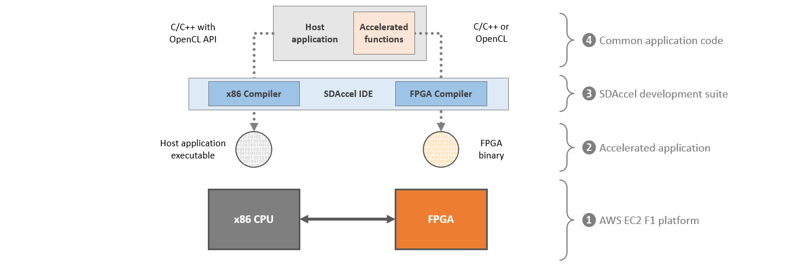

## Running the "Hello World" Example

#### Overview of the AWS F1 platform and SDAccel flow

The architecture of the AWS F1 platform and the SDAccel development flow are pictured below:



1. Amazon EC2 F1 is a compute instance combining x86 CPUs with Xilinx FPGAs. The FPGAs are programmed with custom hardware accelerators which can accelerate complex workloads up to 30x when compared with servers that use CPUs alone.
2. An F1 application consists of an x86 executable for the host application and an FPGA binary (also referred to as Amazon FPGA Image or AFI) for the custom hardware accelerators. Communication between the host application and the accelerators are automatically managed by the OpenCL runtime.
3. SDAccel is the development environment used to create F1 applications. It comes with a fully fledged IDE, x86 and FPGA compilers, profiling and debugging tools.
4. The host application is written in C or C++ and uses the OpenCL API to interact with the accelerated functions. The accelerated functions (also referred to as kernels) can be written in C, C++, OpenCL or even RTL.

#### Running the "Hello World" Example

The "hello world" example is an OpenCL application with a simple vector-addition accelerator. This example uses a precompiled FPGA binary to reduce compilation time and streamline the lab.

1. Open a new terminal by right-clicking anywhere in the Desktop area and selecting **Open Terminal**.

1.  Source the SDAccel environment  

    ```bash
    cd ~/src/project_data/aws-fpga
    source sdaccel_setup.sh
    cd ~
    ```
	*Note: the sdaccel_setup.sh script might generate warning messages, but these can be safely ignored.*

1.  Compile the host application

    ```bash
    # Go to the lab directory
    cd ~/SDAccel-AWS-F1-Developer-Labs/modules/module_01/helloworld

    # Compile the host application (./helloworld)
    make compile_host
    ```

1. Confirm the presence of the precompiled FPGA binary.

    ```bash
    ls -la ./xclbin/vector_addition_hw.awsxclbin
    ```

1. Execute the host application with the precompiled FPGA binary on the F1 instance.

    ```bash
    sudo sh
    source /opt/xilinx/xrt/setup.sh
    make run TARGET=hw
    ```

1. The host application executes using the vector_addition kernel running in the FPGA and produces the following results:

	```
	shell
	xclProbe found 1 FPGA slots with xocl driver running
    	Found Platform
	Platform Name: Xilinx
	Found Device=xilinx_aws-vu9p-f1-04261818_dynamic_5_0
	INFO: Reading ../xclbin/vector_addition_hw.awsxclbin
	Loading: '../xclbin/vector_addition_hw.awsxclbin'
	This AFI already loaded. Skip reload!
	Successfully skipped reloading of local image.
	AFI load complete.
	Result = 
	Hello World !!! 
	Hello World !!! 
	Hello World !!! 
	Hello World !!! 
	Hello World !!! 
	Hello World !!! 
	Hello World !!! 
	Hello World !!! 
	Hello World !!! 
	Hello World !!! 
	Hello World !!! 
	Hello World !!! 
	Hello World !!! 
	Hello World !!! 
	Hello World !!! 
	Hello World !!! 
	TEST PASSED
	sh-4.2#
	```

1. You compiled a host application and successfully executed it on F1 using a pre-compiled Amazon FPGA Image (AFI).

1. Close your terminal.

    ```bash
    exit
    
    ```

This concludes this first lab.

---------------------------------------

<p align="center"><b>
Start the next lab: <a href="lab_02_idct_introduction.md">Using the SDAccel xocc compiler to develop F1 accelerated applications</a>
</b></p>
