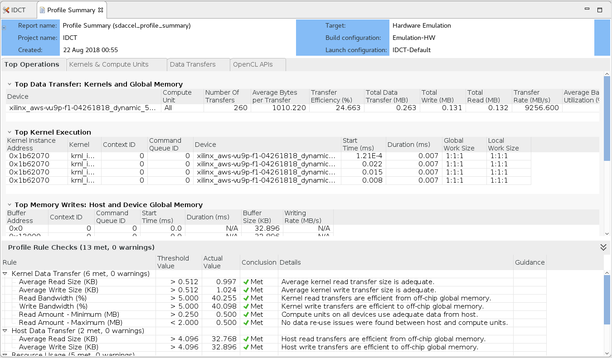
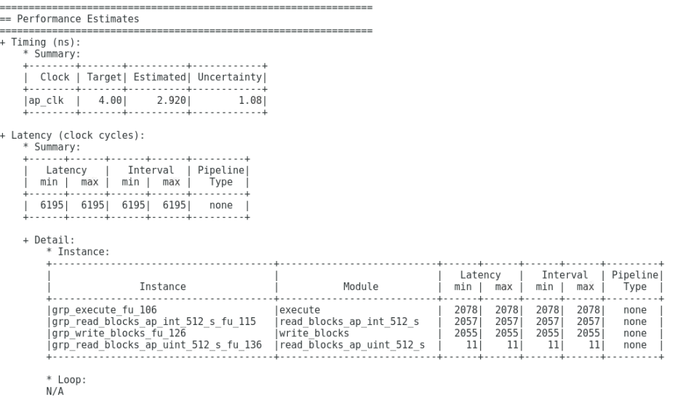
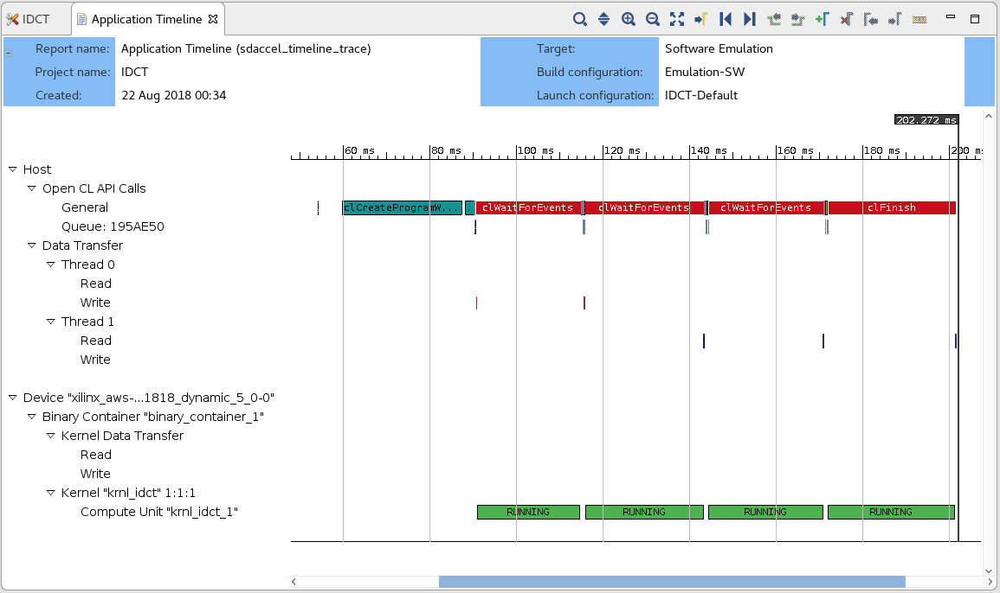

## Using the SDAccel xocc compiler to develop F1 accelerated applications

This lab is designed to teach the fundamentals of the SDAccel development environment and programming model. This includes: familiarizing with OpenCL, understanding software and hardware emulation flows, profiling performance and identifying how to optimize host and kernel code.

The kernel used in this lab is an Inverse Discrete Cosine Transform (IDCT), a function widely used in audio/image codecs such as HEVC.


### Setting Up SDAccel Environment

1.  Open a new terminal by right-clicking anywhere in the Desktop area and selecting **Open Terminal**.

1.  Set up the SDAccel environment.  

    ```bash
    cd ~/src/project_data/aws-fpga
    source sdaccel_setup.sh
    ```
	*Note: the sdaccel_setup.sh script might generate warning messages, but these can be safely ignored.*

1.  Go to design folder and investigate the files.
    ```bash
    # Go to the lab directory
    cd ~/SDAccel-AWS-F1-Developer-Labs/modules/module_01/idct/
    ls
    ```
	  The `src` folder contains the kernel source file and host code. The `Makefile` is provided for design compilation and execution. Let's open up the make file and take a look at its contents.
    ```
    vi Makefile
    ```

    In 'platform selection' section, the default target platform is set as `xilinx_aws-vu9p-f1-04261818_dynamic_5_0` which is the AWS F1 platform.

    The next couple of lines define the design files location and filenames. Following that is the host compiler settings and kernel compiler and linker settings. Notice that in the last line of kernel linker setting, DDR banks are assigned to each port. You don't need to modify any of the options here but you may want to play with them after finishing this tutorial.

    Exit Makefile view window and let's take a look at the design files.

### Overview of the source code used in this example

1.  The project is comprised of two files under src directory:
	* **idct.cpp** contains the code for the host application running on the CPU.
	* **krnl_idct.cpp** contains the code for the kernel (custom accelerator) running on the FPGA.

1.  Open the **krnl_idct.cpp** file.
	* The **idct** function is the core algorithm implemented in the custom hardware accelerator.
	* This computationally heavy function can be highly parallelized on the FPGA, providing significant acceleration over a CPU-based implementation.
	* The **krnl_idct** function is the top-level for the custom hardware accelerator. Interface properties for the accelerator are specified in this function.
	* The **krnl_idct_dataflow** function is called by the top-level function and encapsulates the main functions of the accelerator.
	* The **read_blocks** function reads from global memory values sent by the host application and streams them to the **execute** function.
	* The **execute** function receives the streaming data and, for each 8x8 block received, calls the **idct** function to perform the actual computation. Streams the results back out.
	* The **write_blocks** function receives the streaming results from the **execute** function and writes them back to global memory for the host application.

1. Open the **idct.cpp** file.  
	* The **main** function of the C++ program initializes the test vectors, sets-up OpenCL, runs the reference model, runs the hardware accelerator, releases the OpenCL resources, and compares the results of the reference IDCT model with the accelerator implementation.
	* The **runFPGA** function takes in a vector of inputs and, for each 8x8 block, calls the hardware accelerated IDCT using the **write**, **run**, **read**, and **finish** helper functions. These function use OpenCL API calls to communicate with the FPGA and are covered in greater detail later in this lab.
	* The **runCPU** function takes in a vector of inputs and, for each 8x8 block, calls **idctSoft**, a reference implementation of the IDCT .
	* The **idctSoft** function is the reference software implementation of the IDCT algorithm, used in this example to check the results coming back from the FPGA. 	
	* The **oclDct** class is used to encapsulate the OpenCL runtime calls to interact with the kernel in the FPGA.
	* The **aligned_allocator**, **smalloc**, **load_file_to_memory**, and **getBinaryName** functions are small helper functions used during test vector generation and OpenCL setup.

1. Go to line 520 of the **idct.cpp** file.

	This section of code is where the OpenCL environment is setup in the host application. This section is typical of most SDAccel application and will look very familiar to developers with prior OpenCL experience. This body of code can often be reused as-is from project to project.

	To setup the OpenCL environment, the following API calls are made:

	* **clGetPlatformIDs**: This function queries the system to identify the different OpenCL platforms. It is called twice as it first extracts the number of platforms before extracting the actual supported platforms.
	* **clGetPlatformInfo**: Get specific information about the OpenCL platform, such as vendor name and platform name.
	* **clGetDeviceIDs**: Obtain list of devices available on a platform.
	* **clCreateContext**: Creates an OpenCL context, which manages the runtime objects.
	* **clGetDeviceInfo**: Get information about an OpenCL device like the device name.
	* **clCreateProgramWithBinary**: Creates a program object for a context, and loads specified binary data into the program object. The actual program is obtained before this call through the load_file_to memory function.
	* **clCreateKernel**: Creates a kernel object.
	* **clCreateCommandQueue**: Create a command-queue on a specific device.

	Note: all objects accessed through a **clCreate...** function call are to be released before terminating the program by calling **clRelease...**. This avoids memory leakage and clears the locks on the device.

	All of the above API functions are documented by the [Khronos Group](https://www.khronos.org), the maintainers of OpenCL, the open standard for parallel programming of heterogeneous systems.

### Running the Emulation Flows

  SDAccel provides two emulation flows which allow testing the application before deploying it on the F1 instance. The flows are referred to as software emulation and hardware emulation, respectively.
  * Software emulation is used to identify syntax issues and verify the behavior of application.
  * Hardware emulation is used to get performance estimates for the accelerated application.

1. Run below commands in the terminal window.
    ```bash
    make run TARGET=sw_emu
    ```
    This will run through software emulation and print out messages as shown in below to indicate the process finishes successfully.

    ```bash
    TEST PASSED
    RUN COMPLETE
    ```

    The generated files are put into `build` folder under `design` directory. You can use `ls` command to investigate the generated files.

1. After software emulation finishes successfully, you can move forward to run the design in hardware emulation. The corresponding command is:
    ```bash
    make run TARGET=hw_emu
    ```

	* In hardware emulation, the host code is compiled to run on the x86 processor and the kernel code is compiled into a hardware model (known as RTL or Register Transfer Level) which is run in RTL simulator.
	* The build and run cycle takes longer because the kernel code is compiled into a detailed hardware model which is slower to simulate.
	* The more detailed hardware simulation allow more accurate reporting of kernel and system performance.
	* This flow is also useful for testing the functionality of the logic that will go in the FPGA.
	* The hardware emulation is complete when the following messages are displayed:

    ```bash
    TEST PASSED
    RUN COMPLETE
    INFO: [SDx-EM 22] [Wall clock time: 02:43, Emulation time: 0.0298064 ms] Data transfer between kernel(s) and global memory(s)
    krnl_idct_1:m_axi_gmem0-DDR          RD = 128.000 KB             WR = 0.000 KB        
    krnl_idct_1:m_axi_gmem1-DDR          RD = 0.500 KB               WR = 0.000 KB        
    krnl_idct_1:m_axi_gmem2-DDR          RD = 0.000 KB               WR = 128.000 KB    
    ```

### Analyzing the Reports  

This section covers how to locate and read the various reports generated by the emulation runs. The goal of the section is to understand the analysis reports of SDAccel before utilizing them in the next section.  

#### Profile Summary report

After the emulation run completes, an profile_summary_hw_emu.csv file is generated in the `build` folder. Before viewing it in SDAccel GUI, it must be converted into an appropriate format.

1. Convert the .csv file to the .xprf format
```
cd build; 
sdx_analyze profile -i profile_summary_hw_emu.csv -f protobuf
```

2. Open the converted profile summary .xprf file in the SDAccel GUI
```
sdx -workspace tmp -report profile_summary_hw_emu.xprf
```

  

  This report provides data related to how the application runs. Notice that the report has four tabs at the bottom: **Top Operations**, **Kernels & Compute Units**, **Data Transfers**, and **OpenCL APIs**.

  Click through and inspect each of the tabs:

  * **Top Operations**: Shows all the major top operations of memory transfer between the host and kernel to global memory, and kernel execution. This allows you to identify throughput bottlenecks when transferring data. Efficient transfer of data to the kernel/host allows for faster execution times.

  * **Kernels & Compute Units**: Shows the number of times the kernel was executed. Includes the total, minimum, average, and maximum run times. If the design has multiple compute units, it will show each compute unit’s utilization. When accelerating an algorithm, the faster the kernel executes, the higher the throughput which can be achieved. It is best to optimize the kernel to be as fast as it can be with the data it requires.

  * **Data Transfers**: This tab has no bearing in software emulation as no actual data transfers are emulated across the host to the platform. In hardware emulation, this shows the throughput and bandwidth of the read/writes to the global memory that the host and kernel share.

  * **OpenCL APIs**: Shows all the OpenCL API command executions, how many time each was executed, and how long they take to execute.

3. Click on the **Kernels & Compute Units** tab of the **Profile Summary** report, locate and note the following numbers:

  - Kernel Total Time (ms):

This number will serve as reference point to compare against after optimization.    

#### HLS reports

The SDAccel xocc compiler also generates **HLS Reports** for each kernel. **HLS Reports** explain the results of compiling the kernel into hardware. It contains many details (including clocking, resources or device utilization) about the performance and logic usage of the custom-generated hardware logic. These details provide many insights to guide the kernel optimization process.    

1. Locate the HLS reports:
```
find . -name "*_csynth.rpt"
```

2. Open the **krnl_idct_dataflow_csynth.rpt** file, scroll to the **Performance Estimates** section, locate the **Latency (clock cycles)**  summary table and note the following performance numbers:

  - Latency (min/max):
  - Interval (min/max):




  * Note that the 3 sub-functions read, execute and write have roughly the same latency and that their sum total is equivalent to the total Interval reported in the **Summary** table.
  * This indicates that the three sub-functions are executing sequentially, hinting to an optimization opportunity.


#### Application Timeline report

In addition to the profile_summary_hw_emu.csv file, the emulation run also generates an timeline_trace_hw_emu.csv file in yhe `build` folder. Before viewing it in SDAccel GUI, it must be converted into an appropriate format.

1. Convert the .csv file to the .wdb format
    ```
    cd build; 
    sdx_analyze trace -i timeline_trace_hw_emu.csv -f wdb
    ```

1. Execute the following command to load timeline trace in SDAccel GUI
   ```
   sdx -workspace tmp --report timeline_trace_hw_emu.wdb
   ```



The **Application Timeline** collects and displays host and device events on a common timeline to help you understand and visualize the overall health and performance of your systems. These events include OpenCL API calls from the host code: when they happen and how long each of them takes.


### Summary  

In this lab, you learned:
* Important OpenCL API calls to communicate between the host and the FPGA
* The differences between the software and hardware emulation flows and how to run them
* How to read the various reports generated by SDAccel


In the next lab you utilize these analysis capabilities to drive and measure code optimizations.

---------------------------------------

<p align="center"><b>
Start the next lab: <a href="lab_03_idct_optimization.md">Optimizing F1 applications</a>
</b></p>  
