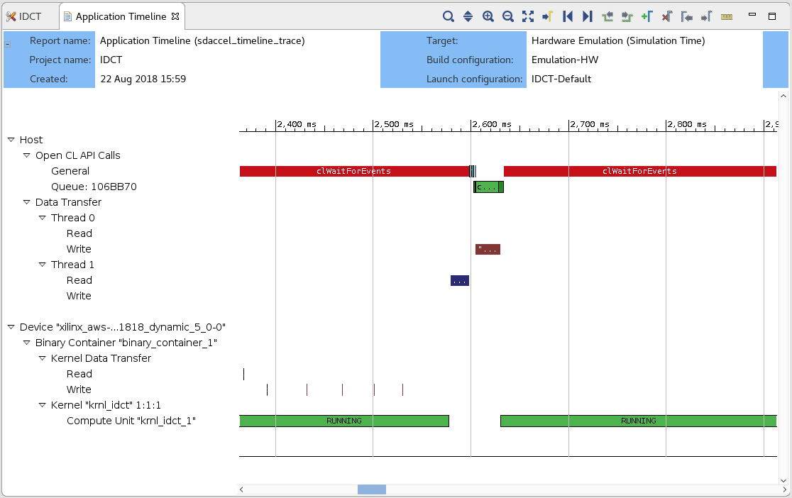
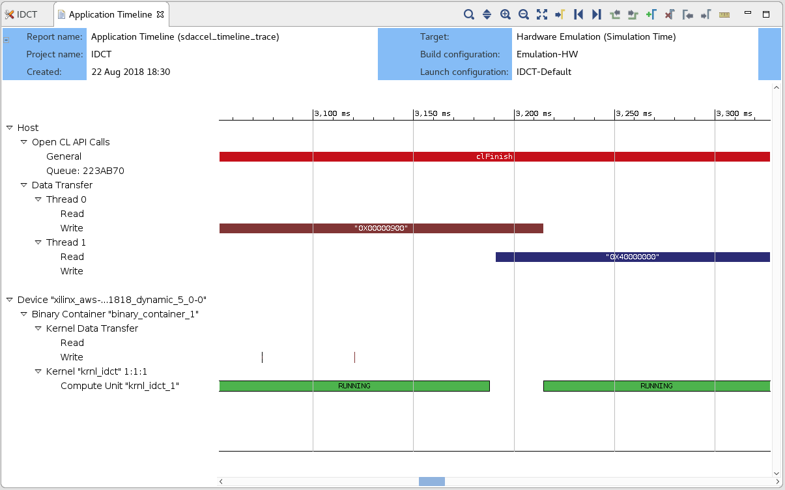

## Optimizing F1 applications

This lab builds on the previous one ([Using XOCC command line flow to develop and compile F1 accelerator](lab_02_idct.md)) which gave an overview of the SDAccel development environment and explained the various performance analysis capabilities provided by the tool. In this lab you will utilize these analysis capabilities to drive and measure code optimizations. This lab illustrates the DATAFLOW optimization for the kernel and software pipelining for the host application.

Please note that although the entire lab is performed on an F1 instance, only the final step of this lab really needs to be run on F1. All the interactive development, profiling and optimization steps would normally be performed on-premise or on a cost-effective AWS EC2 instance such as C4. However, to avoid switching from C4 to F1 instances during this lab, all the steps are performed on the F1 instance.

If you have closed the terminal window at the end of the previous lab, open a new one and go back to the project folder:

```bash
cd ~/SDAccel-AWS-F1-Developer-Labs/modules/module_01/idct
```

### Optimizing the IDCT kernel

Remember when we Looked at the **HLS Report**, we identified that the read, execute and write functions of the **krnl_idct_dataflow** function have roughly the same latency and are executing sequentially. We still start by focusing on this performance aspect.

1. Open **krnl_idct.cpp** file inside src directory.

1. Navigate to the **krnl_idct_dataflow** function.

1. Observe that the three functions are communicating using `hls::streams` objects. These objects model a FIFO-based communication scheme. This is the recommended coding style which should be used whenever possible to exhibit streaming behavior and allow DATAFLOW optimization.

1. Enable the DATAFLOW optimization by uncommenting the **#pragma DATAFLOW** present in the **krnl_idct_dataflow** function (line 322).

    - The DATAFLOW optimization allows each of the subsequent functions to execute as independent processes.
    - This results in overlapping and pipelined execution of the read, execute and write functions instead of sequential execution.
    - The FIFO channels between the different processes do not need to buffer the complete dataset anymore but can directly stream the data to the next block.

1. Comment out the three **#pragma HLS stream** statements on lines 327, 328 and 329.

1. Save the file.

1. Clean the generated files before launching hardware emulation with updated source file.
    ```
    make clean
    ```

1. Rerun hardware emulation.
    ```
    make run TARGET=hw_emu
    ```

1. Open the new **krnl_idct_dataflow_csynth.rpt** and compare the new latency numbers reported in the **Performance Estimates** section with the previous numbers and you will note considerable improvement based on the DATAFLOW optimization.  
    - Latency (min/max):
    - Interval (min/max):

1. Open the new profile summary report for the hardware emulation and select the **Kernels & Compute Units** tab. If you forget how to view the report, you can go back to previous lab for detailed steps.

1. Compare the **Kernel Total Time (ms)** with the results from the unoptimized run.

### Building the FPGA binary to execute on F1

The next step is to create an FPGA binary to test the optimized kernel on the FPGA attached to the F1 instance.

Creating the FPGA binary is a two-step process:
* First SDAccel is used to build the Xilinx FPGA binary (.xclbin file).
* Then the AWS **create_sdaccel_afi.sh** script is used to create the AWS FPGA binary (.awsxclbin file) and register a secured and encrypted Amazon FPGA Image (AFI).

The **create_sdaccel_afi.sh** script does the following:
* Starts a background process to create the AFI
* Generates a \<timestamp\>_afi_id.txt which contains the FPGA Image Identifier (or AFI ID) and Global FPGA Image Identifier (or AGFI ID) of the generated AFI
* Creates the *.awsxclbin AWS FPGA binary file which is read by the host application to determine which AFI should be loaded in the FPGA.

These steps would take too long to complete during this lab, therefore a precompiled FPGA binary is used to continue this lab and execute on F1.

1. Bring-up the terminal from which you started the tool.

1. Confirm that the precompiled FPGA binary (.awsxclbin file) is indeed present.

    ```bash
    # Go the lab folder
    cd ~/SDAccel-AWS-F1-Developer-Labs/modules/module_01/idct

    # List contents of the ./xclbin directory to look for the .awsxclbin FPGA binary
    ls -la ./xclbin
    ```

1. Retrieve the Fpga Image Global Id (agfi) from the \<timestamp\>_afi_id.txt file.

    ```bash
    more ./xclbin/19_12_18-170118_afi_id.txt
    ```

1. Confirm that the AFI is ready and available using the retrieved global AFI Id.

    ``` bash
    aws ec2 describe-fpga-images --fpga-image-ids afi-014f8e35d6d00344c
    ```

   The output of this command should contain:

    ```json
    ...
    "State": {
        "Code": "available"
    },
    ...
    ```

### Executing on F1
1. Execute the accelerated application on F1 using the precompiled FPGA binary.

    ```bash
    cd ~/SDAccel-AWS-F1-Developer-Labs/modules/module_01/idct
    sudo sh
    # Source the SDAccel runtime environment
    source /opt/xilinx/xrt/setup.sh
    # Execute the host application with the .awsxclbin FPGA binary
    ./build/IDCT.exe ./xclbin/krnl_idct.hw.awsxclbin
    exit
    ```

1. Here is the output of the above comamnd 
   ```
   CPU Time:        2.38773 s
   CPU Throughput:  214.43 MB/s
   FPGA Time:       0.431608 s
   FPGA Throughput: 1186.26 MB/s
   ```

Note the performance difference between the IDCT running on the CPU and on the FPGA. FPGA s about 5x faster than running on CPU. 


### Optimizing the host code

For optimal performance both the hardware and software components of the application need to be optimized. This next sections shows how the **software pipelining** technique can be used to overlap transactions from the host to the kernels and thereby improve overall system throughput.

1. Return to the project folder in terminal window.

1. Open **idct.cpp** file.  

1. Navigate to the **runFPGA** function.

	For each block of 8x8 values, the **runFPGA** function writes data to the FPGA, runs the kernel, and reads results back.

	Communication with the FPGA is handled by OpenCL API calls made within the cu.write, cu.run and cu.read functions.
	- **clEnqueueMigrateMemObjects** schedules the transfer of data to or from the FPGA.
	- **clEnqueueTask** schedules the executing of the kernel.

	These OpenCL functions use events to signal their completion and synchronize execution.


1. Execute the following command to to convert the timeline trace to wdb format and then load timeline trace in SDAccel GUI. You may need to close the previous opened SDAccel GUI.
   ```
   sdx_analyze trace -f wdb -i ./timeline_trace.csv
   sdx -workspace tmp --report timeline_trace.wdb
   ```

1. Zoom in by performing a **Left mouse drag** to get a more detailed view.  

    - The two green segments correspond to two consecutive invocations of the IDCT kernel.
    - The gap between the two segments is indicative of idle time between these two invocations.
    - The **Data Transfer** section of the timeline shows that **Read** and **Write** operations are happening when the kernel is idle.
    - The **Read** operation is to retrieve the results from the execution which just finished and the **Write** operation is to send inputs for the next execution.
    - This represents a sequential execution flow of each iteration.  

    


1. Close the application timeline report.    

1. In the **idct.cpp** file, go to the **oclDct::write** function.

	- Observe that on line 293, the function synchronizes on the **outEvVec** event through a call to **clWaitForEvents**.
	- This event is generated by the completion of the **clEnqueueMigrateMemObjects** call in the **oclDct::read** function (line 369).
	- Effectively the next execution of the **oclDct::write** function is gated by the completion of the previous **oclDct::read** function, resulting in the sequential behavior observed in the **Application Timeline**.


1. Navigate to the definition of the **NUM_SCHED** macro in the **idct.cpp** file.

	- This macro defines the depth of the event queue.
	- The value of **1** explains the observed behavior: new tasks (write, run, read) are only enqueued when the previous has completed effectively synchronizing each loop iteration.
	- By increasing the value of the **NUM_SCHED** macro, we increase the depth of the event queue and enable more blocks to be enqueued for processing. This will result in the write, run and read tasks to overlap and allow the kernel to execute continuously.
	- This technique is called **software pipelining**.

1. Modify line 153 to increase the value of **NUM_SCHED** to 6 as follows:
    ```C
    #define NUM_SCHED 6
    ```

1. Save the file.

1. Rerun hardware emulation.
    ```bash
    make run TARGET=hw_emu
    ```
    - Since only the **idct.cpp** file was changed, the incremental makefile rebuilds only the host code before running emulation.
    - This results in a much faster iteration loop since it is usually the compilation of the kernel to hardware which takes the most time.

1. Convert the newly generated application timeline report

    ```bash
    cd build;
    sdx_analyze trace -i timeline_trace_hw_emu.csv -f wdb
    sdx -workspace tmp --report timeline_trace_hw_emu.wdb

    ```

1. Open the timeline_trace_hw_emu.wdb file in the GUI. Observe how **software pipelining** enables overlapping of data transfers and kernel execution.

    

    Note: system tasks might slow down communication between the application and the hardware simulation, impacting on the measured performance results. The effect of software pipelining is considerably higher when running on the actual hardware.

### Executing on F1

The next step is to confirm these results by running on the FPGA attached to the F1 instance. Since only the host application was modified, the same precompiled FPGA binary can used.

1. Execute the accelerated application on F1 using the precompiled FPGA binary.
    
    ```bash
    cd ~/SDAccel-AWS-F1-Developer-Labs/modules/module_01/idct
    sudo sh
    # Source the SDAccel runtime environment
    source /opt/xilinx/xrt/setup.sh
    # Execute the host application with the .awsxclbin FPGA binary
    ./build/IDCT.exe ./xclbin/krnl_idct.hw.awsxclbin
    exit
    ```
1. Here is the output of the above comamnd 
   ```
   CPU Time:        2.38849 s
   CPU Throughput:  214.361 MB/s
   FPGA Time:       0.23884 s
   FPGA Throughput: 2143.7 MB/s
   ```
   Note the performance difference between the IDCT running on the CPU and on the FPGA. FPGA s about 10x faster than running on CPU. Note as well the performance difference with the previous run on F1. Using exactly the same FPGA binary but an optimized host application, the overall performance is significantly improved.


### Summary  

In this lab, you learned:
* How to use the various reports generated by SDAccel to drive optimization decisions
* How to use pragmas to increase kernel performance
* How to use software pipelining to increase system performance
 
---------------------------------------

<p align="center"><b>
Finish this module: <a href="lab_04_wrap_up.md">Wrap-up and Next Steps</a>
</b></p>  
