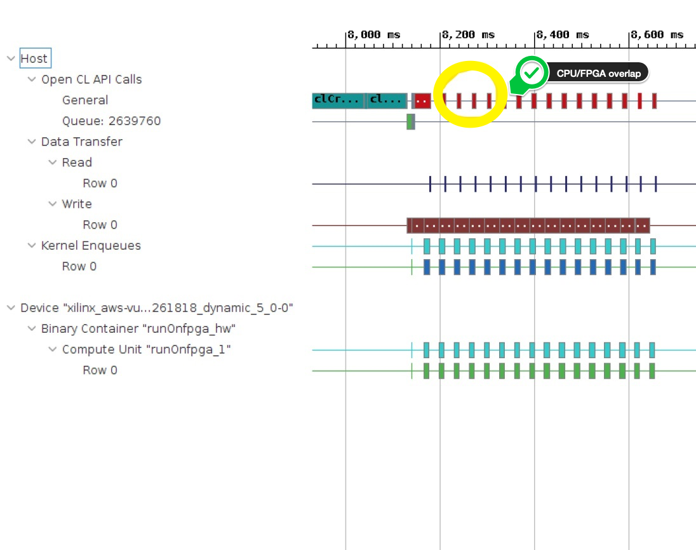

# Part 2: Data Movement Between the Host and Kernel

## Step 1: Naive Approach

The initial version of the accelerated application follows the structure of original software version. The entire input buffer is transfered from the host to the FPGA in a single transaction. Then, the FPGA accelerator performs the computation. Lastly, the results are read back from the FPGA to the host before being post-processed. 

The following figure shows the sequential write-compute-read pattern implemented in this first step

  

The FPGA accelerator computes the hash values and flags for the provided input words.

The inputs to the accelerator are as follows:

* `input_doc_words`: Input array which contains the 32-bit words for all the documents.
* `bloom_filter`: Bloom filter array which contains the inserted hash values of search array.
* `total_size`: Unsigned int which represents the total size processed by the FPGA when it is called.
* `load_weights`: Boolean which allows to load the `bloom_filter` array only once to the FPGA in the case of multiple kernel invocations.

The output of the accelerator is as follows:

* `output_inh_flags`: Output array of 8-bit outputs where each bit in the 8-bit output indicates whether a word is present in the bloom filter which is then used for computing score in the CPU.

The accelerator is architected to process 8 words in parallel at 250Mhz. In the test runs we process 401,022,976 words. We can therefore estimate the theoretical FPGA computation time as follows:

* Number of words/(Clock freq * Parallelization factor in Kernel) = 401022976 / (250\*1000000\*8) = 174.86 ms


### Run the Application

1. Go to the `makefile` directory and run the make command.

    ```bash
    cd ~/SDAccel-AWS-F1-Developer-Labs/modules/module_02/makefile
    make run STEP=single_buffer SOLUTION=1
    ```

2. The output is as follows.

    ```
    --------------------------------------------------------------------
     Executed FPGA accelerated version  |  1030.6703 ms   ( FPGA 616.349 ms )
     Executed Software-Only version     |  3694.6240 ms
    --------------------------------------------------------------------
     Verification: PASS
    ```
    
    While this initial version is already 3.5x faster than the software-only version, you can see that is noticeably slower than the optimized version which you ran at then of the previous lab. 
    

### Profile Summary Analysis

1. Change your working directory to `modules/module_02/build/single_buffer`.

    ```bash
    cd ~/SDAccel-AWS-F1-Developer-Labs/modules/module_02/build/single_buffer
    ```
   
2. Run the following command to look at the Profile Summary Report.

    ```bash
    sdx_analyze  profile  -f html -i ./profile_summary.csv
    firefox profile_summary.html
    ```

*  Looking at the *Kernel Execution* section in the report, we see the kernel execution time as 175.173 ms.

    

   As you can see, the actual kernel execution time closely matches the theoretical number. 
    

### Timeline Trace Analysis

1. Run the following commands to view the Timeline Trace report.

    ```bash
    sdx_analyze trace -f wdb -i ./timeline_trace.csv
    sdx -workspace workspace -report timeline_trace.wdb
    ```

2. Zoom in to display the timeline trace report as follows:


As expected, there is a sequential execution of operations starting from the data transferred from the host to the FPGA, followed by compute in the FPGA and transferring back the results from the FPGA to host.

3. Exit the SDAccel application to return to the terminal.

### Conclusion

The Profile Summary and Timeline Trace reports are useful tools to analyze the performance of the FPGA-accelerated application. The kernel execution times matches the theoretical expectations and the Timeline Trace provides a visual confirmation that this initial version performs data transfers and computation sequentially.  
 
To further improve performance, you will look into overlapping data transfers and compute.

## Step 2: Overlapping Data Transfer and Compute

In the previous step, you noticed a sequential execution of the write, compute, and read (that is, the compute does not start until the entire input is read into the FPGA and similarly, the host read from the FPGA does not start until compute is done).

To improve performance, you can split and send the input buffer in multiple iterations and start the compute as soon as the data for the corresponding iteration is transferred to the FPGA. Because the compute of a given iteration is independent of other iterations, you can overlap the compute of a given iteration with the data transfer for the next iteration. This will improve performance: instead of executing sequentially, data transfer and compute are overlapped. The following figure illustrates this for the case where the input data is split in two sub-buffers.

   

### Host Code Modifications

> **NOTE:** If you started sdx to view the profile in the previous step, you may need to exit the application to get back to the terminal.

1. Change your working directory to `modules/module_02/reference_files`.
    ```bash
    cd ~/SDAccel-AWS-F1-Developer-Labs/modules/module_02/reference_files
    ```
2. Open `run_split_buffer.cpp` file with a file editor.

3. The lines 64-148 are modified to optimize the host code to send the input buffer in two iterations, enabling overlap of data transfers with accelerator execution. This is explained in detail as follows:

a. The two sub buffers for "input_doc_words" & "output_inh_flags" are created as follows:

```cpp
  // Make buffers resident in the device
  q.enqueueMigrateMemObjects({buffer_bloom_filter, buffer_input_doc_words, buffer_output_inh_flags}, CL_MIGRATE_MEM_OBJECT_CONTENT_UNDEFINED);
  
  // Specify size of sub-buffers, one for each transaction 
  unsigned subbuf_doc_sz = total_doc_size/2;
  unsigned subbuf_inh_sz = total_doc_size/2;
  
  // Declare sub-buffer regions to specify offset and size of sub-buffer   
  cl_buffer_region subbuf_inh_info[2];
  cl_buffer_region subbuf_doc_info[2];
  
  // Declare sub-buffers
  cl::Buffer subbuf_inh_flags[2];
  cl::Buffer subbuf_doc_words[2];
  
  // Specify offset and size of sub-buffers 
  subbuf_inh_info[0]={0, subbuf_inh_sz*sizeof(char)};
  subbuf_inh_info[1]={subbuf_inh_sz*sizeof(char), subbuf_inh_sz*sizeof(char)};
  subbuf_doc_info[0]={0, subbuf_doc_sz*sizeof(uint)};
  subbuf_doc_info[1]={subbuf_doc_sz*sizeof(uint), subbuf_doc_sz*sizeof(uint)};
  
  // Create sub-buffers from buffers based on sub-buffer regions
  subbuf_inh_flags[0] = buffer_output_inh_flags.createSubBuffer(CL_MEM_WRITE_ONLY, CL_BUFFER_CREATE_TYPE_REGION, &subbuf_inh_info[0]);
  subbuf_inh_flags[1] = buffer_output_inh_flags.createSubBuffer(CL_MEM_WRITE_ONLY, CL_BUFFER_CREATE_TYPE_REGION, &subbuf_inh_info[1]);
  subbuf_doc_words[0] = buffer_input_doc_words.createSubBuffer (CL_MEM_READ_ONLY,  CL_BUFFER_CREATE_TYPE_REGION, &subbuf_doc_info[0]);
  subbuf_doc_words[1] = buffer_input_doc_words.createSubBuffer (CL_MEM_READ_ONLY,  CL_BUFFER_CREATE_TYPE_REGION, &subbuf_doc_info[1]);
  
  printf("\n");
  double mbytes_total  = (double)(total_doc_size * sizeof(int)) / (double)(1000*1000);
  double mbytes_block  = mbytes_total / 2;
  printf(" Processing %.3f MBytes of data\n", mbytes_total);
  printf(" Splitting data in 2 sub-buffers of %.3f MBytes for FPGA processing\n", mbytes_block);  
```
 
b. Vector of events are created to coordinate the read, compute, and write operations such that each iteration is independent of          other iteration, which allows for overlap between the data transfer and compute.
  
```cpp
  // Create Events to co-ordinate read,compute and write for each iteration 
  vector<cl::Event> wordWait;
  vector<cl::Event> krnlWait;
  vector<cl::Event> flagWait;
  
  printf("--------------------------------------------------------------------\n");
  
  chrono::high_resolution_clock::time_point t1, t2;
  t1 = chrono::high_resolution_clock::now();
```
   
c. Kernel arguments are set and kernel is enqueued to load the bloom filter coefficients
   
```cpp
  // Only load the bloom filter in the kernel
  cl::Event buffDone,krnlDone,flagDone;
  total_size = 0;
  load_filter = true;
  kernel.setArg(3, total_size);
  kernel.setArg(4, load_filter);
  q.enqueueMigrateMemObjects({buffer_bloom_filter}, 0, NULL, &buffDone);
  wordWait.push_back(buffDone);
  q.enqueueTask(kernel, &wordWait, &krnlDone);
  krnlWait.push_back(krnlDone);
```

d. First iteration: kernel arguments are set, commands to write the input buffer to the FPGA, execute the kernel and read the results back to the host are enqueued. 
   
```cpp
  //  Set Kernel Arguments, Read, Enqueue Kernel and Write for first iteration
  total_size = total_doc_size/2;
  load_filter=false;
  kernel.setArg(3, total_size);
  kernel.setArg(4, load_filter);
  kernel.setArg(0, subbuf_inh_flags[0]);
  kernel.setArg(1, subbuf_doc_words[0]);
  q.enqueueMigrateMemObjects({subbuf_doc_words[0]}, 0, &wordWait, &buffDone); 
  wordWait.push_back(buffDone);
  q.enqueueTask(kernel, &wordWait, &krnlDone);
  krnlWait.push_back(krnlDone);
  q.enqueueMigrateMemObjects({subbuf_inh_flags[0]}, CL_MIGRATE_MEM_OBJECT_HOST, &krnlWait, &flagDone);
  flagWait.push_back(flagDone);
```    
      
e. Second iteration: kernel arguments are set, commands to write the input buffer to the FPGA, execute the kernel and read the results back to the host are enqueued. 
   
```cpp
  //  Set Kernel Arguments, Read, Enqueue Kernel and Write for second iteration
  total_size = total_doc_size/2;
  load_filter=false;
  kernel.setArg(3, total_size);
  kernel.setArg(4, load_filter);
  kernel.setArg(0, subbuf_inh_flags[1]);
  kernel.setArg(1, subbuf_doc_words[1]);
  q.enqueueMigrateMemObjects({subbuf_doc_words[1]}, 0, &wordWait, &buffDone); 
  wordWait.push_back(buffDone);
  q.enqueueTask(kernel, &wordWait, &krnlDone);
  krnlWait.push_back(krnlDone);
  q.enqueueMigrateMemObjects({subbuf_inh_flags[1]}, CL_MIGRATE_MEM_OBJECT_HOST, &krnlWait, &flagDone);
  flagWait.push_back(flagDone);
```

f. The host waits until the output is read back from the FPGA.

```cpp
  // Wait until all results are copied back to the host before doing the post-processing
  flagWait[0].wait();
  flagWait[1].wait();
```  

### Run the Application

1. Go to the `makefile` directory and run the `make` command.

    ```bash
    cd ~/SDAccel-AWS-F1-Developer-Labs/modules/module_02/makefile
    make run STEP=split_buffer SOLUTION=1
    ```

2. The output is as follows:

    ```
    --------------------------------------------------------------------
     Executed FPGA accelerated version  |   942.3678 ms   ( FPGA 564.939 ms )
     Executed Software-Only version     |   3640.0865 ms
    --------------------------------------------------------------------
     Verification: PASS
    ```

### Timeline Trace Analysis
1. Change your working directory to `modules/module_02/build/split_buffer`.

   ```bash
   cd ~/SDAccel-AWS-F1-Developer-Labs/modules/module_02/build/split_buffer
   ```
   
2. Run the following commands to view the Timeline Trace report.

    ```bash
    sdx_analyze trace -f wdb -i ./timeline_trace.csv
    sdx -workspace workspace -report timeline_trace.wdb
    ```

3. Zoom in to display the timeline trace report as follows:


The Timeline Trace confirms that we have achieved the execution schedule that we aspired to obtain: there is an overlap of the read, compute, and write operations between the first and second iterations. The execution time of the first kernel run and the first data read are effectively "hidden" behind the data write time. This results in a faster overall run.

4. Exit the SDAccel application to return to the terminal.

### Conclusion

The total execution time on the FPGA has been improved by vertue of overlapping computation with data transfers. The execution time of the first kernel run and the first data read have been eliminated.

## Step 3: Overlap of Data Transfer and Compute with Multiple Buffers

In the previous step, you split the input buffer into two sub-buffers and overlapped the first compute with the second data transfer. In this step, you will write generic code, so the input data is split and processed in an arbitrary number of iterations to achieve the optimal execution time.

### Host Code Modifications

> **NOTE:** If you started sdx to view the profile in the previous step, you may need to exit the application to get back to the terminal.

1. Change your working directory to `modules/module_02/reference_files`.

   ```bash
   cd ~/SDAccel-AWS-F1-Developer-Labs/modules/module_02/reference_files
   ```

2. Open `run_generic_buffer.cpp` file with a file editor.

3. The lines 67-139 are modified to optimize the host code to send the input buffer in multiple iterations to enable overlapping of        data transfer an compute. It is explained in detail as follows

a. Multiple sub buffers are created for "input_doc_words" & "output_inh_flags" as follows
    
```cpp
  // Specify size of sub buffers for each iteration
  unsigned subbuf_doc_sz = total_doc_size/num_iter;
  unsigned subbuf_inh_sz = total_doc_size/num_iter;
  
  // Declare sub buffer regions to specify offset and size for each iteration
  cl_buffer_region subbuf_inh_info[num_iter];
  cl_buffer_region subbuf_doc_info[num_iter];
  
  // Declare sub buffers
  cl::Buffer subbuf_inh_flags[num_iter];
  cl::Buffer subbuf_doc_words[num_iter];
  
  // Define sub buffers from buffers based on sub-buffer regions
  for (int i=0; i<num_iter; i++)  {
    subbuf_inh_info[i]={i*subbuf_inh_sz*sizeof(char), subbuf_inh_sz*sizeof(char)};
    subbuf_doc_info[i]={i*subbuf_doc_sz*sizeof(uint), subbuf_doc_sz*sizeof(uint)};
    subbuf_inh_flags[i] = buffer_output_inh_flags.createSubBuffer(CL_MEM_WRITE_ONLY, CL_BUFFER_CREATE_TYPE_REGION, &subbuf_inh_info[i]);
    subbuf_doc_words[i] = buffer_input_doc_words.createSubBuffer (CL_MEM_READ_ONLY,  CL_BUFFER_CREATE_TYPE_REGION, &subbuf_doc_info[i]);
  }
  
  printf("\n");
  double mbytes_total  = (double)(total_doc_size * sizeof(int)) / (double)(1000*1000);
  double mbytes_block  = mbytes_total / num_iter;
  printf(" Processing %.3f MBytes of data\n", mbytes_total);
  if (num_iter>1) {
    printf(" Splitting data in %d sub-buffers of %.3f MBytes for FPGA processing\n", num_iter, mbytes_block);
  }
```
 
b. Vector of events are created to coordinate the read, compute, and write operations such that every iteration is independent of         other iterations, which allows for overlap between the data transfer and compute.
     
```cpp
  // Create Events for co-ordinating read,compute and write for each iteration
  vector<cl::Event> wordWait;
  vector<cl::Event> krnlWait;
  vector<cl::Event> flagWait;
  
  printf("--------------------------------------------------------------------\n");
  
  chrono::high_resolution_clock::time_point t1, t2;
  t1 = chrono::high_resolution_clock::now();
```
        
c. Kernel arguments are set and the kernel is enqueued to load the bloom filter coeffecients
 
```cpp
  // Set Kernel arguments and load the bloom filter coefficients in the kernel
  cl::Event buffDone, krnlDone;
  total_size = 0;
  load_filter = true;
  kernel.setArg(3, total_size);
  kernel.setArg(4, load_filter);
  q.enqueueMigrateMemObjects({buffer_bloom_filter}, 0, NULL, &buffDone);
  wordWait.push_back(buffDone);
  q.enqueueTask(kernel, &wordWait, &krnlDone);
  krnlWait.push_back(krnlDone);
```

d. For each iteration: kernel arguments are set, commands to write the input buffer to the FPGA, execute the kernel and read the results back to the host are enqueued.
      
```cpp
  // Set Kernel arguments. Read, Enqueue Kernel and Write for each iteration
  for (int i=0; i<num_iter; i++)
  {
    cl::Event buffDone, krnlDone, flagDone;
    total_size = subbuf_doc_info[i].size / sizeof(uint);
    load_filter = false;
    kernel.setArg(0, subbuf_inh_flags[i]);
    kernel.setArg(1, subbuf_doc_words[i]);
    kernel.setArg(3, total_size);
    kernel.setArg(4, load_filter);
    q.enqueueMigrateMemObjects({subbuf_doc_words[i]}, 0, &wordWait, &buffDone);
    wordWait.push_back(buffDone);
    q.enqueueTask(kernel, &wordWait, &krnlDone);
    krnlWait.push_back(krnlDone);
    q.enqueueMigrateMemObjects({subbuf_inh_flags[i]}, CL_MIGRATE_MEM_OBJECT_HOST, &krnlWait, &flagDone);
    flagWait.push_back(flagDone);
  }
```

e. The host waits until the output of each iteration is read back to the host.
     

```
  // Wait until all results are copied back to the host before doing the post-processing
  for (int i=0; i<num_iter; i++)
   {
    flagWait[i].wait();
   }
```          

 
 The above code is generic enough to split the data into an arbitrary number of multiple buffers.

### Run the Application
   

1. Go to the `makefile` directory and run the `make` command.
 
    ```bash
    cd ~/SDAccel-AWS-F1-Developer-Labs/modules/module_02/makefile
    make run STEP=generic_buffer ITER=16 SOLUTION=1
    ```
   The argument `ITER` represents the number of iterations of data transfer from host to FPGA.

2. Run the above `make` command with `ITER` values as 1,2,4,8,16,32,64. 

3. Plotting a graph with the execution times of different `ITER` values varying with `ITER` is as follows

    
 
   As we can see from the above graph that 16 iterations seems to give the best performance.
 
4. The output with `ITER` 16 is as follows.

    ```
    --------------------------------------------------------------------
     Executed FPGA accelerated version  |   899.2955 ms   ( FPGA 515.489 ms )
     Executed Software-Only version     |   3639.3084 ms
    --------------------------------------------------------------------
     Verification: PASS
    ```

### Timeline Trace Analysis
1. Change your working directory to `modules/module_02/build/generic_buffer`.

    ```bash
    cd ~/SDAccel-AWS-F1-Developer-Labs/modules/module_02/build/generic_buffer
    ```
   
2. Run the following commands to look at Timeline Trace report.

    ```bash
    sdx_analyze trace -f wdb -i ./timeline_trace.csv
    sdx -workspace workspace -report timeline_trace.wdb
    ```

3. Zoom in to display the timeline trace report as follows.


As you can see from the report, the input buffer is split into 16 sub buffers, and there are overlaps between read, compute, and write for all iterations. The total computation is divided in 16 iterations, but 15 of them are happening simultaneously with data transfers and therefore only the last compute counts towards total FPGA execution time.

4. Exit the SDAccel application to return to the terminal.

### Conclusion

From the above Profile Summary and Timeline Trace reports, you see that the total execution time on the FPGA improved from the previous steps after splitting the input data into multiple buffers, allowing additional overlap between the data transfer and compute. 

## Step 4: Overlap Between the host CPU and FPGA

In the previous steps, you looked at optimizing the execution time of the FPGA by overlapping the data transfer and compute. After the FPGA compute is complete, the CPU computes the document scores based on the output from the FPGA. FPGA processing and CPU post-processing execute sequentially. 

Looking at the previous timeline trace reports, you can see red segments on the very first row which shows the *OpenCL API Calls* made by the *Host* application. This indicates that the host is waiting, staying idle while the FPGA compute the hash and flags. In this step, you will overlap the FPGA processing with the CPU post-processing.

Because the total compute is split into multiple iterations, you can start post-processing on the host CPU once the corresponding iteration is complete, allowing overlap between the CPU and FPGA processing. The performance increases because the CPU is also processing in parallel with the FPGA, which reduces the execution time. The following figure illustrates this type of overlap.

   

## Host Code Modifications

1. Change your working directory to `modules/module_02/reference_files`.

    ```bash
    cd ~/SDAccel-AWS-F1-Developer-Labs/modules/module_02/reference_files
    ```

2. Open `run_sw_overlap.cpp` file with a file editor.

3. The lines 134-171 are modified to optimize the host code such that CPU processing is overlapped with FPGA processing. It is explained in detail as follows
     
a. Following variables are created to keep track of the words processed by FPGA 
     
```cpp
  // Create variables to keep track of number of words needed by CPU to compute score and number of words processed by FPGA such that CPU processsing can overlap with FPGA
  unsigned int curr_entry;
  unsigned char inh_flags;
  unsigned int  available = 0;
  unsigned int  needed = 0;
  unsigned int  iter = 0;
```

b. Block the host only if the hash function of the words are still not computed by FPGA thereby allowing overlap between CPU & FPGA processing.
     
```cpp
  for(unsigned int doc=0, n=0; doc<total_num_docs;doc++)
  {
    unsigned long ans = 0;
    unsigned int size = doc_sizes[doc];

    // Calculate size by needed by CPU for processing next document score
    needed += size;
 
    // Check if flgas processed by FPGA is greater than needed by CPU. Else, block CPU
    // Update the number of available words and sub-buffer count(iter)
   
    if (needed > available)
    {
      flagWait[iter].wait();
      available += subbuf_doc_info[iter].size / sizeof(uint);
      iter++;
    }

    for (unsigned i = 0; i < size ; i++, n++)
    {
      curr_entry = input_doc_words[n];
      inh_flags  = output_inh_flags[n];

      if (inh_flags)
      {
        unsigned frequency = curr_entry & 0x00ff;
        unsigned word_id = curr_entry >> 8;
        ans += profile_weights[word_id] * (unsigned long)frequency;
      }
    }
    profile_score[doc] = ans;
  }
```


### Run the Application

1. Go to the `modules/module_02/makefile` directory and run the `make` command.

    ```bash
    cd ~/SDAccel-AWS-F1-Developer-Labs/modules/module_02/makefile
    make run STEP=sw_overlap ITER=16 SOLUTION=1
    ```

2. The output is as follows.

    ```
    --------------------------------------------------------------------
    Executed FPGA accelerated version  |   552.5344 ms   ( FPGA 528.744 ms )
    Executed Software-Only version     |   3864.4070 ms
    --------------------------------------------------------------------
    Verification: PASS
    ```

### Timeline Trace Analysis
1. Change your working directory to `modules/module_02/build/sw_overlap`.

    ```bash
    cd ~/SDAccel-AWS-F1-Developer-Labs/modules/module_02/build/sw_overlap
    ```
   
2. Run the following commands to view the Timeline Trace report.

    ```bash
    sdx_analyze trace -f wdb -i ./timeline_trace.csv
    sdx -workspace workspace -report timeline_trace.wdb
    ```

3. Zoom in to display the timeline trace report as follows.



As seen above in *OpenCL API Calls* of the *Host* section with the yellow marking, the red segments are shorter in width indicating that the processing time of the host CPU is now overlapping with FPGA processing, which improved the overall application execution time. In the previous steps, the host remained completely idle until the FPGA finished all its processing.

4. Exit the SDAccel application to return to the terminal.

### Conclusion

Congratulations. You have successfully completed Module 1!

In this lab, you worked with a pre-defined FPGA accelerator and learned that optimizing how the host application interacts with the accelerator makes a significant difference. An naive initial implementation delivered a 3.6x performance improvement over the reference software implementation. By leveraging data-parallelism, overlapping data transfers and compute and overlapping CPU processing with FPGA processing, application performance was increased by another 2x, achieving a total of 7x acceleration.

In the next module, you will create and optimize a two-dimensional convolution accelerator used to filter a video stream at 30fps. 

---------------------------------------

<p align="center"><b>
Start the second module: <a href="../module_03/README.md">Methodology for Optimizing Accelerated FPGA Applications</a>
</b></p>
